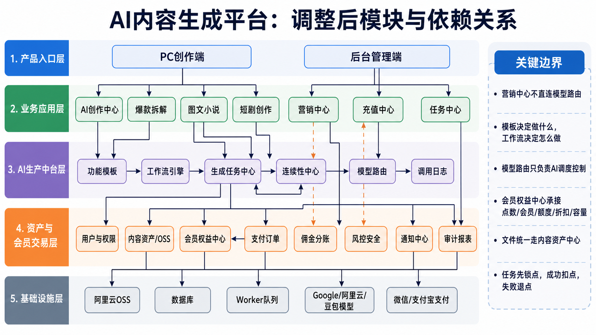
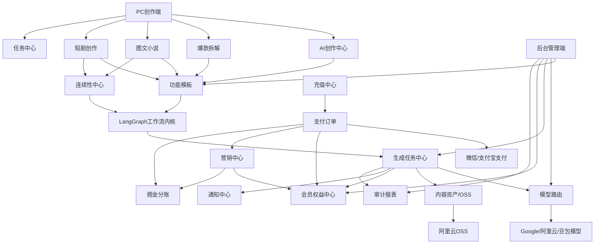

# AI 内容生成平台架构总纲

> 沟通沉淀日期：2026-05-04  
> 架构图：

## 1. 方案定位

本方案面向一套 **PC 创作端 + 后台管理端** 的 AI 内容生成商业平台。

平台不是单纯的 AI 工具集合，而是面向内容生产、平台运营、会员付费、营销增长和财务结算的完整系统，目标支撑：

- 用户在 PC 端完成文案、图片、视频、音频、办公、内容提取、爆款拆解、图文小说、短剧剧本/分镜等内容生产。
- 后台可管理 AI 供应商、模型、密钥、上下线、权重、模板、Prompt、工作流、任务、点数消耗和调用日志。
- 平台可运营充值、会员、点数、营销中心、邀请注册、返佣、分账/结算。
- 长内容场景支持跨章节/跨剧集连续性，包括人物关系、人物性格、说话习惯、伏笔、事件时间线和一致性检查。
- 所有 AI 调用、文件资产、点数扣费、营销奖励、佣金结算都可追踪、可复算、可审计。

核心原则：

- AI 功能入口和底层模型能力分离。
- 功能模板决定“做什么”，LangGraph 工作流决定“怎么做”。
- 平台父子任务系统负责业务任务，LangGraph 只作为 AI 工作流内核。
- 模型路由只负责 AI 调度控制，不被营销、支付等业务模块直接使用。
- 文件统一由内容资产中心管理，真实文件存阿里云 OSS。
- 会员权益中心承接点数、会员、额度、折扣、容量和功能权限。
- 佣金分账中心处理现金权益，不和点数账本混用。

## 2. 端与核心角色

### 2.1 PC 创作端

PC 端面向普通用户、商家运营、自媒体创作者、短剧团队、小说创作者和企业团队。

核心入口：

```text
首页工作台
AI 创作中心
爆款拆解
图文小说
短剧创作
任务中心
项目中心
营销中心
充值中心
账户中心
```

### 2.2 后台管理端

后台端面向平台运营、财务、审核、客服、技术运营和超级管理员。

核心入口：

```text
数据看板
用户管理
AI 能力管理
功能模板管理
生成任务管理
内容资产管理
会员权益管理
订单支付管理
营销管理
佣金结算管理
风控审核
系统设置
```

### 2.3 角色边界

| 角色 | 主要能力 |
|---|---|
| 普通用户 | 使用 AI 功能、查看任务、保存项目、充值会员 |
| 创作者/商家 | 使用品牌资产、批量生成素材、管理项目 |
| 短剧/小说用户 | 管理长内容项目、人物、章节/剧集、导出 |
| 推广员 | 邀请注册、查看推广数据、查看佣金 |
| 平台运营 | 管理模板、活动、内容、任务、看板 |
| 平台财务 | 管理订单、退款、佣金、结算、对账 |
| 内容审核 | 审核违规文本、图片、视频、项目内容 |
| 超级管理员 | 管理模型密钥、路由、权限、系统配置 |

## 3. 总体分层

系统分为五层，依赖方向原则上只能从上往下。

```text
产品入口层
  PC创作端 / 后台管理端

业务应用层
  AI创作中心 / 爆款拆解 / 图文小说 / 短剧创作 / 营销中心 / 充值中心 / 任务中心

AI生产中台层
  功能模板 / LangGraph工作流内核 / 平台生成任务中心 / 连续性中心 / 模型路由 / 调用日志

资产与会员交易层
  用户与权限 / 内容资产OSS / 会员权益中心 / 支付订单 / 佣金分账 / 风控安全 / 通知中心 / 审计报表

基础设施层
  阿里云OSS / 数据库 / Worker队列 / Google阿里云豆包模型 / 微信支付宝支付
```

关键边界：

- 业务功能不直连模型供应商。
- 营销中心不直连模型路由。
- AI 生成任务不直接管理 OSS 文件细节。
- AI 模块不直接管理财务结算。
- 支付订单不直接管理营销奖励。
- 佣金分账不进入会员点数账本。

## 4. 核心模块清单

### 4.1 用户与权限中心

职责：

- 用户注册、登录、资料、账号状态。
- 后台管理员登录。
- 后台角色、菜单、按钮权限。
- 企业/团队空间预留。

边界：

- 不处理点数扣减。
- 不处理模型调用。
- 不处理佣金结算。

被依赖方：

```text
AI生成任务
项目中心
会员权益中心
营销中心
充值支付
佣金分账
风控审计
```

### 4.2 AI 能力中心

AI 能力中心包括供应商、模型、路由和调用日志。

#### AI 供应商管理

职责：

- 管理 Google、阿里云、豆包等供应商。
- 管理 API 地址、认证方式、状态。
- API Key 后台录入，服务端加密存储。
- 前端只显示密钥掩码。
- 密钥修改、供应商启停必须写审计日志。

边界：

- 不知道用户业务。
- 不知道模板语义。
- 不直接被 PC 用户端调用。

#### AI 模型管理

职责：

- 管理具体模型编码、名称、能力类型。
- 配置模型上下线、超时、并发、价格、上下文长度。
- 支持文本、图片、视频、OCR、ASR、办公生成等能力。
- 支持模型测试调用。

关键能力类型：

```text
TEXT
IMAGE
VIDEO
OCR
ASR
DOCUMENT
ANALYSIS
EMBEDDING
```

#### 模型路由

职责：

- 按能力级默认路由和模板级覆盖路由选择模型。
- 支持权重配置、模型上下线、失败兜底、熔断、成本控制。
- 保存路由决策日志和路由快照。

路由优先级：

```text
模板级路由 > 能力级默认路由 > 系统兜底模型
```

模型路由控制的是 AI 调度，不是营销控制。

示例：

```text
朋友圈文案 -> 豆包 80% + 通义 20%
商业推理 -> Gemini 70% + 通义 30%
图片生成 -> 阿里云图片模型 100%
短剧剧本 -> 高推理文本模型优先
```

### 4.3 功能模板中心

功能模板是用户端看到的 AI 功能入口。

用户端叫：

```text
AI 功能
```

后台叫：

```text
功能模板
```

技术对象叫：

```text
ai_template
```

职责：

- 管理模板分类、名称、描述、图标、排序、上下线。
- 管理输入字段、Prompt、输出格式、点数消耗。
- 管理模板级模型路由覆盖。
- 管理 Prompt 版本、模板版本和工作流版本。

核心分类：

| 分类 | 功能 |
|---|---|
| 营销文案 | IP人设文案、同城流量文案、招商加盟文案、朋友圈文案、大字报标题、门店获客 |
| 短视频直播 | 口播文案、直播文案、爆款视频复刻、拍摄镜头拆解、话术重点拆解 |
| 品牌企业 | 品牌文案、企业文案、人设文案、商户文案 |
| 电商内容 | 淘宝/京东/拼多多文案、电商产品图、产品图生视频 |
| 爆款创作 | 爆款拆解、爆款制作、内容结构拆解 |
| 深度处理 | 文案改写、文案深度处理、长文理解、商业思考推理 |
| 图片生成 | 文字生图、图片生图、人物图、美食图、精品图、图文小说配图 |
| 图片处理 | 画质增强、虚拟试衣、去水印、智能抠图、局部重绘、风格化 |
| 视频生成 | 文生视频、图生视频、视频生视频、混剪视频、长视频生成 |
| 办公智能体 | PPT生成、表格制作、流程图、思维导图 |
| 内容提取 | 网页提取、视频提取、图片OCR、音频转文字 |

模板和工作流关系：

```text
模板决定做什么
工作流决定怎么一步步做完
模型路由决定每一步调用哪个模型
```

### 4.4 LangGraph 工作流内核

LangGraph 作为 AI 工作流内核接入，但不作为平台任务系统。

职责：

- 编排 AI 步骤。
- 管理工作流状态流转。
- 支持分支、循环、子图。
- 支持 checkpoint、恢复执行。
- 支持人工确认节点。
- 支持连续性检查流程。

适合承接：

```text
爆款视频拆解
图文小说单章生成
短剧单集剧本生成
短剧单集分镜生成
长文理解与摘要合并
PPT 大纲到逐页内容生成
```

不负责：

- 用户任务中心展示。
- 父子任务业务进度。
- 点数锁定、扣减、退回。
- 文件资产归属。
- 会员权益。
- 佣金结算。
- 后台运营看板。

### 4.5 平台生成任务中心

平台生成任务中心是业务任务系统，必须自建。

职责：

- 创建用户生成任务。
- 管理普通任务和父子任务。
- 管理任务排队、执行、暂停、继续、取消、重试。
- 管理任务进度、状态、错误、超时。
- 调用会员权益中心进行锁点、扣点、退点。
- 关联内容资产中心保存结果。
- 生成任务完成/失败通知。
- 为后台提供任务监控。

任务和 LangGraph 关系：

```text
generation_parent_task
  -> generation_child_task
      -> langgraph_run_id
      -> langgraph_thread_id
      -> langgraph_checkpoint_id
```

平台父子任务负责业务层，LangGraph 负责子任务内部 AI 编排。

必须使用父子任务的场景：

| 功能 | 父任务 | 子任务 |
|---|---|---|
| 图文小说 | 整本小说 | 故事圣经、人物、章节大纲、单章正文、单章配图、导出 |
| 短剧创作 | 整部短剧 | 短剧设定、人物关系、分集大纲、单集剧本、单集分镜、导出 |
| 长视频生成 | 整条长视频 | 分段脚本、分段视频、字幕、合成 |
| 混剪视频 | 混剪项目 | 素材分析、片段筛选、时间线、转码、合成 |
| 爆款视频复刻 | 复刻任务 | ASR、抽帧、结构拆解、新脚本、新分镜 |
| PPT生成 | 整份PPT | 大纲、逐页内容、图表、渲染、导出 |
| 视频提取 | 提取任务 | 上传解析、音轨提取、ASR、关键帧、摘要 |

### 4.6 连续性中心

连续性中心服务图文小说和短剧创作。

职责：

- 故事圣经。
- 人物档案。
- 说话习惯。
- 人物关系图。
- 伏笔台账。
- 事件时间线。
- 一致性检查。
- 自动纠偏。

核心对象：

```text
story_bible
character_profile
character_voice_profile
relationship_graph
foreshadowing_record
timeline_event
continuity_snapshot
continuity_check_result
```

生成前：

```text
读取故事圣经
读取人物档案
读取说话习惯
读取人物关系
读取未回收伏笔
读取最近章节/剧集事件
构建 continuity_snapshot
```

生成后：

```text
提取关键事件
更新人物状态
更新关系变化
更新伏笔状态
更新事件时间线
执行一致性检查
必要时自动纠偏
```

### 4.7 内容资产中心

内容资产中心统一管理文件和素材。

职责：

- 管理用户上传素材。
- 管理 AI 生成文件。
- 管理图片、音频、视频、PPT、PDF、Word、Excel、字幕、缩略图。
- 对接阿里云 OSS。
- 生成私有文件临时签名 URL。
- 管理文件生命周期和容量。

存储原则：

| 内容 | 存储方式 |
|---|---|
| 短文本 | 数据库 |
| 结构化结果 | 数据库 JSON |
| 图片 | OSS |
| 音频 | OSS |
| 视频 | OSS |
| PPT/PDF/Word/Excel | OSS |
| 缩略图/封面/字幕 | OSS asset_variant |

访问原则：

```text
前端不直接持有永久 OSS 地址
后端先校验权限
再生成临时签名 URL
```

### 4.8 会员权益中心

会员权益中心替代原“点数权益”单一概念，承接更完整的商业化能力。

职责：

- 点数账户。
- 点数锁定、扣减、退回。
- 点数流水。
- 会员套餐。
- 每日/月度额度。
- 功能权限。
- 并发数限制。
- 批量任务额度。
- 生成折扣。
- 文件容量。
- 项目数量。
- 企业成员数。
- API 额度预留。

核心边界：

- 点数不是现金，不可提现。
- 会员权益中心不处理现金佣金。
- 佣金分账中心单独处理可提现现金权益。

依赖关系：

```text
生成任务中心 -> 会员权益中心：校验权益、锁点、扣点、退点
充值中心 -> 会员权益中心：充值到账、开通会员
营销中心 -> 会员权益中心：发放点数、优惠权益
```

### 4.9 充值支付中心

职责：

- 点数包购买。
- 会员套餐购买。
- 订单创建。
- 微信/支付宝支付。
- 支付回调。
- 退款预留。
- 发票预留。
- 支付对账预留。

边界：

- 充值支付中心只处理交易订单。
- 不直接计算邀请佣金。
- 支付成功后发布业务事件，由会员权益中心入账，由营销中心判断奖励资格。

### 4.10 营销中心

职责：

- 邀请注册。
- 邀请链接/邀请码/海报。
- 注册送点数。
- 优惠券。
- 活动任务。
- 渠道码。
- 推广数据。
- 返佣资格判断。

关键边界：

- 营销中心不直连模型路由。
- 营销中心只产生奖励资格，不直接进行现金结算。
- 如果营销中心需要生成活动文案或邀请海报，应通过功能模板创建 AI 生成任务。

正确调用链：

```text
营销中心需要生成活动素材
-> AI 功能模板
-> 生成任务中心
-> 工作流/LangGraph
-> 模型路由
```

### 4.11 佣金分账中心

职责：

- 首充返佣。
- 渠道返佣。
- 代理分润。
- 佣金冻结。
- 可结算金额。
- 提现审核。
- 官方分账预留。
- 结算记录。

佣金状态：

```text
PENDING
FROZEN
SETTLEABLE
PROCESSING
SETTLED
INVALID
```

关键规则：

- 用户退款后佣金失效或回退。
- 佣金是现金权益，不进入点数账户。
- 分账应走微信/支付宝官方能力，避免平台形成违规资金池。

### 4.12 风控安全、通知、审计报表

#### 风控安全

职责：

- 异常注册。
- 刷邀请。
- 异常充值。
- 异常生成。
- 高频失败。
- 违规内容。
- 异常提现。
- 模型成本异常。

#### 通知中心

职责：

- 任务完成通知。
- 任务失败通知。
- 充值成功通知。
- 会员到期提醒。
- 佣金到账提醒。
- 审核结果提醒。

#### 审计报表

职责：

- 密钥修改日志。
- 模型上下线日志。
- 路由变更日志。
- 模板/Prompt 修改日志。
- 财务操作日志。
- 权限变更日志。
- AI 调用成本报表。
- 模型成功率报表。
- 营销 ROI 报表。

## 5. 关键依赖关系

推荐依赖图：



依赖确认：

| 关系 | 口径 |
|---|---|
| 营销中心 -> 模型路由 | 不允许直接依赖 |
| 营销中心 -> AI生成 | 通过功能模板和生成任务间接调用 |
| 生成任务 -> 模型路由 | 允许，用于执行 AI 调用 |
| 图文小说/短剧 -> 连续性中心 | 必须依赖 |
| 图文小说/短剧 -> 模型供应商 | 不允许直接依赖 |
| 生成任务 -> 会员权益中心 | 必须依赖，用于锁点、扣点、退点 |
| 文件结果 -> 内容资产中心 | 必须依赖，不直接散落在业务表 |
| 佣金 -> 会员权益中心 | 不混账本 |
| 佣金 -> 支付订单 | 依赖支付成功和退款状态 |

## 6. 核心业务流程

### 6.1 普通 AI 生成

```text
用户选择功能模板
-> 填写输入
-> 创建生成任务
-> 会员权益中心校验权益并锁点
-> 工作流引擎读取模板、Prompt、路由和上下文
-> LangGraph 执行 AI 步骤
-> 模型路由选择供应商和模型
-> 保存文本结果或文件资产
-> 内容安全和质量检查
-> 成功确认扣点，失败退点
-> 发送站内通知
```

### 6.2 爆款拆解

```text
上传文案/图片/视频
-> 内容资产中心保存素材
-> 创建拆解任务
-> 多模态提取：OCR/ASR/抽帧/文本清洗
-> 结构化分析：钩子、冲突、卖点、节奏、转化
-> 生成可复刻 brief
-> 可继续发起爆款制作任务
```

### 6.3 图文小说

```text
创建小说项目
-> 生成故事圣经
-> 生成人物档案和人物关系
-> 生成 20-100 章大纲
-> 用户确认
-> 父任务批量生成章节
-> 子任务生成章节正文
-> 子任务生成每章 1-3 张配图
-> 连续性检查
-> 更新事件时间线和伏笔台账
-> 导出 Word/PDF/Markdown
```

### 6.4 短剧创作

```text
创建短剧项目
-> 生成短剧设定
-> 生成人物关系和说话习惯
-> 生成 100 集以内分集大纲
-> 用户确认前 3-5 集样稿
-> 父任务批量生成剧本
-> 子任务生成单集剧本
-> 子任务生成单集分镜
-> 连续性检查
-> 导出剧本/分镜表/拍摄清单
```

### 6.5 充值与会员权益

```text
用户选择点数包或会员套餐
-> 创建支付订单
-> 微信/支付宝支付
-> 支付成功回调
-> 会员权益中心发放点数或开通会员
-> 生成权益流水
-> 营销中心判断活动奖励
```

### 6.6 邀请返佣

```text
用户 A 生成邀请链接
-> 用户 B 注册
-> 营销中心绑定邀请关系
-> B 首次充值
-> 营销中心判断奖励资格
-> 佣金分账中心生成佣金记录
-> 冻结期
-> 可结算
-> 提现审核或官方分账
```

## 7. AI 功能实现抽象

所有 AI 功能底层统一为：

```text
输入 Schema
-> Prompt/上下文构建
-> 工作流节点执行
-> 模型路由
-> 结果校验
-> 资产保存
-> 结果交付
```

通用节点类型：

```text
TEXT_GENERATE
TEXT_REWRITE
TEXT_ANALYZE
IMAGE_GENERATE
IMAGE_EDIT
VIDEO_GENERATE
VIDEO_ANALYZE
AUDIO_TRANSCRIBE
OCR_EXTRACT
WEB_EXTRACT
STRUCTURE_EXTRACT
CONTINUITY_CHECK
ASSET_SAVE
EXPORT_RENDER
HUMAN_APPROVAL
```

## 8. 任务设计

### 8.1 普通任务

适合：

- 普通文案生成。
- 单图生成。
- 单图处理。
- 普通网页提取。
- 单张图片 OCR。

特点：

- 一个任务一个主要结果。
- 可以异步执行，但不需要子任务。
- 仍然需要任务记录、扣点和调用日志。

### 8.2 父子任务

适合：

- 长内容。
- 批量生成。
- 多步骤生成。
- 多文件处理。
- 允许部分成功的任务。

父子任务状态：

```text
DRAFT
WAITING_APPROVAL
QUEUED
PROCESSING
PARTIAL_SUCCEEDED
SUCCEEDED
FAILED
CANCELED
```

子任务失败规则：

- 单个子任务失败不影响已成功子任务。
- 失败子任务可单独重试。
- 成功子任务确认扣点。
- 失败子任务退回锁点。

### 8.3 LangGraph 和任务关系

```text
父任务：平台业务任务
子任务：平台业务子任务
LangGraph run：子任务内部 AI 编排实例
LangGraph checkpoint：AI 工作流恢复点
```

示例：

```text
父任务：生成一部 80 集短剧
子任务：生成第 12 集剧本
LangGraph：读取连续性快照 -> 生成剧本 -> 检查口吻 -> 检查伏笔 -> 生成分镜
```

通用任务引擎的触发、状态机、上下文、handler 分发、产物和 API 设计，见 [通用异步任务系统设计方案](../../../docs/designs/async-task-system-design.md)。

## 9. 内容资产与文件存储

生产环境使用阿里云 OSS。

OSS 路径建议：

```text
prod/ai/{file_type}/{yyyy}/{mm}/{dd}/{user_id}/{task_no}/{asset_no}.{ext}
```

示例：

```text
prod/ai/image/2026/05/04/10023/AI20260504143000123/AS20260504143100987.png
prod/ai/video/2026/05/04/10023/AI20260504143000123/AS20260504143100988.mp4
prod/ai/document/2026/05/04/10023/AI20260504143000123/AS20260504143100989.pptx
```

生命周期建议：

| 文件类型 | 保留策略 |
|---|---|
| 用户项目资产 | 长期保留 |
| 已保存作品 | 长期保留 |
| 未保存生成结果 | 30-90 天 |
| 失败任务临时文件 | 7 天 |
| 转码中间文件 | 1-7 天 |
| 风控拦截文件 | 私有保留，后台可查 |

## 10. 后台管理能力

后台能力清单：

| 模块 | 功能 |
|---|---|
| AI供应商管理 | 供应商、API Key、启停、状态 |
| AI模型管理 | 模型、能力、上下线、价格、超时、并发 |
| 模型路由管理 | 能力默认路由、模板覆盖路由、权重、熔断 |
| 功能模板管理 | 分类、输入字段、Prompt、消耗点数、上下线 |
| 工作流管理 | 节点编排、LangGraph 配置、人工确认点 |
| 任务管理 | 父子任务、进度、取消、重试、失败退点 |
| 调用日志 | 供应商、模型、耗时、token、成本、错误 |
| 资产管理 | 用户素材、AI 文件、OSS 状态、签名访问 |
| 会员权益管理 | 会员、点数、额度、折扣、容量、功能权限 |
| 订单支付管理 | 充值订单、会员订单、支付回调、退款 |
| 营销管理 | 活动、邀请、优惠券、任务、渠道码 |
| 佣金结算 | 返佣规则、佣金、提现、分账 |
| 风控审核 | 异常邀请、异常生成、违规内容、异常提现 |
| 审计报表 | 操作日志、AI 成本、模型质量、营销 ROI |

## 11. MVP 建议

### 一期：基础商业闭环

目标：

- 跑通 AI 生成功能、模型后台、异步任务、文件资产、会员权益和充值。

范围：

```text
用户与权限
AI供应商/模型/路由
功能模板
普通生成任务
内容资产/OSS
会员权益中心
充值支付
任务中心
基础后台管理
```

建议首批 AI 功能：

- 营销文案。
- 文案改写。
- 文字生图。
- 图片生图。
- 图片 OCR。
- 音频转文字。
- 网页提取。

### 二期：复杂内容生产

目标：

- 加入爆款拆解、图文小说和短剧剧本/分镜能力。

范围：

```text
LangGraph 工作流内核
父子任务
连续性中心
图文小说
短剧创作
爆款视频拆解
办公生成
```

### 三期：增长与财务

目标：

- 建立用户增长和返佣结算体系。

范围：

```text
营销中心
邀请注册
优惠券
活动任务
渠道码
佣金分账
提现审核
官方分账预留
```

### 四期：治理与规模化

目标：

- 提升稳定性、成本控制、内容安全和企业能力。

范围：

```text
内容安全
模型熔断
成本报表
模板市场
企业团队
API开放
对账
更完整的风控
```

## 12. 当前关键决策汇总

| 决策项 | 最终口径 |
|---|---|
| 产品定位 | AI 内容生产商业平台 |
| 端结构 | PC 创作端 + 后台管理端 |
| AI 编排 | LangGraph 作为 AI 工作流内核 |
| 任务系统 | 平台父子任务系统必须自建 |
| 模型管理 | 后台管理供应商、模型、密钥、上下线 |
| 模型路由 | 能力级默认路由 + 模板级覆盖 |
| 营销关系 | 营销中心不直连模型路由 |
| 权益中心 | 使用会员权益中心，不只做点数账本 |
| 佣金分账 | 现金权益独立，不和点数混用 |
| 文件存储 | 阿里云 OSS，默认私有，签名 URL |
| 图文小说 | 支持 20-100 章，每章 1-3 张配图 |
| 短剧创作 | 支持 100 集以内，首版剧本 + 分镜 |
| 连续性 | 独立连续性中心，支撑小说和短剧 |
| 扣点规则 | 先锁点，成功扣点，失败退点 |
| 历史追溯 | Prompt、路由、模型、任务、资产均保留快照 |

## 13. 后续待确认问题

- MVP 首期是否只做文本和图片，还是同步接入 ASR/OCR。
- 第一版短剧是否需要导出 Excel 分镜表和 Word 剧本。
- 图文小说是否需要支持用户上传角色参考图以保持配图一致。
- 会员套餐如何分层：免费版、专业版、企业版。
- 点数消耗如何定价，尤其图片、视频、长内容和短剧。
- 营销返佣首期是返点数、返现金，还是两者都支持。
- 是否需要企业团队空间和多人协作。
- 内容审核首期接第三方审核，还是先做规则 + 人工复核。
- 对象存储是否只用阿里云 OSS，还是预留 S3/MinIO 适配。
- LangGraph 运行服务是否独立部署为 Python Worker，还是嵌入后端任务 Worker 调用。
