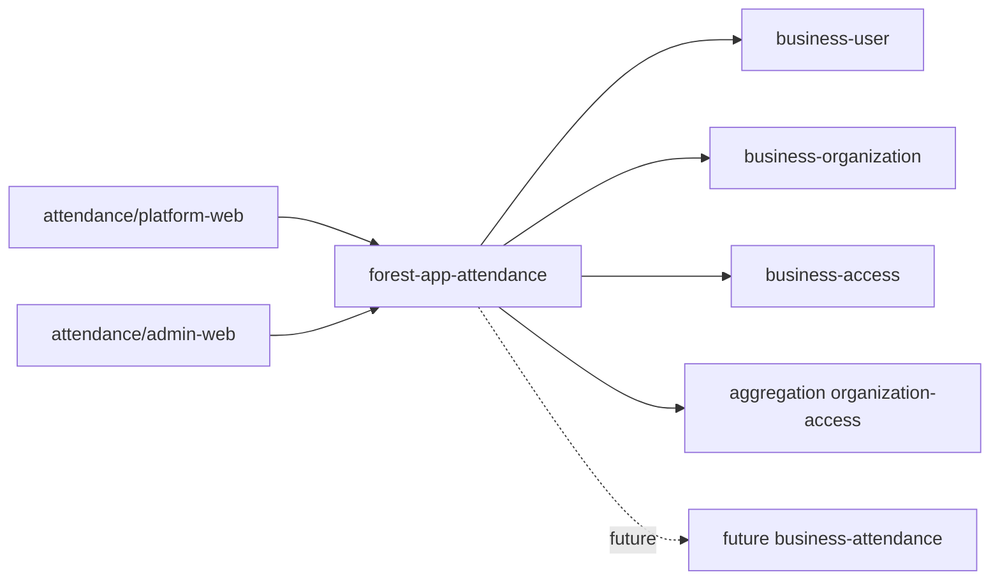

# 考勤系统架构

Attendance app 只负责装配与入口，通用能力继续沉淀在 business 模块。



## 后端装配

`apps/attendance/backend` 当前依赖：

| 模块 | 用途 |
|---|---|
| `forest-starter-auth` | token、登录态、端准入 |
| `forest-business-user` | 用户与登录能力 |
| `forest-business-verification` | 手机验证码 |
| `forest-business-organization` | 企业、部门、员工、认证、企业工作台 |
| `forest-business-access` | RBAC 底座 |
| `forest-aggregation-organization-access` | 企业工作台角色权限聚合接口 |

后端拦截器顺序：

```text
TokenAuthInterceptor
-> OrganizationWorkspaceInterceptor: /api/admin/workspace/**
-> PlatformAccessContextInterceptor: /api/platform/**
```

## Admin-Web

企业后台使用普通 `ADMIN` token。企业工作台接口不把企业信息写入 token，而是在每次请求中带：

```text
X-Organization-No: ORG_xxx
```

后端每次用当前 `userId + organizationNo` 校验 ACTIVE `organization_member`，再写入请求内的企业工作台上下文和 RBAC 上下文。

Admin-Web 当前页面：

| 页面 | 作用 |
|---|---|
| `/login` | 手机号密码/验证码登录 |
| `/organizations` | 我的企业、创建企业、选择企业 |
| `/certification` | 企业资料和认证入口 |
| `/access` | 角色权限管理 |
| `/attendance` | 考勤占位工作台 |

## Platform-Web

平台端使用 `PLATFORM` token，不使用 `X-Organization-No`。

平台登录准入来自配置：

```yaml
forest:
  platform:
    organization-no: ORG_PLATFORM
    boundary-id: 0
```

运行时语义：

| 配置 | 作用 |
|---|---|
| `organization-no` | 决定哪些 user 是平台企业 ACTIVE 员工，允许登录 platform-web |
| `boundary-id` | 决定平台 RBAC 查询边界，默认是 `PLATFORM:0` |

Platform-Web 当前页面：

| 页面 | 作用 |
|---|---|
| `/login` | 平台登录 |
| `/dashboard` | 平台首页占位 |
| `/organizations` | 企业监管占位 |
| `/attendance` | 考勤监管占位 |
