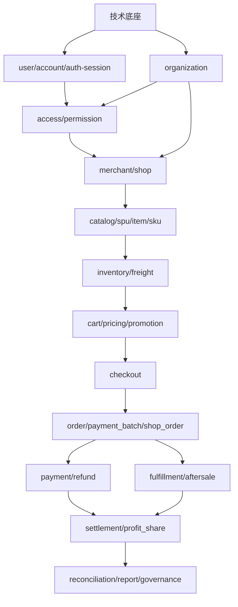

# B2B 多商家商城开发计划

> 本文档用于沉淀 B2B 多商家商城的研发计划，配套参考《B2B 多商家商城业务架构设计方案》。
> 当前版本重点先确定模块拆分、建设顺序、阶段目标、验收口径和后续待讨论事项，后续可继续细化到 PRD、接口、表结构和迭代排期。

## 0. 当前开发进度

更新时间：2026-05-06

当前研发策略：

- 先完成非商城强绑定的基础能力。
- 再做组织、部门、员工、权限。
- 再进入商家、店铺、类目、商品、交易、支付、履约和财务。

### 0.1 总体进度

| 阶段 | 模块 | 当前状态 | 说明 |
|---|---|---|---|
| 阶段 0 | 技术底座和工程规范 | 已具备基础能力 | 当前项目已有 domains / aggregations / apps 分层、统一响应、认证拦截、Flyway migration、前后端 monorepo 结构 |
| 阶段 1 | user + account + auth/session | 已完成第一版实现 | 已落地手机号登录、微信手机号登录、平台密码登录、AuthSession、LoginLog、Token 校验、前端接入和测试 |
| 阶段 1 | organization / tenant / company | 未开始 | 下一步重点，解决企业、租户、组织主体 |
| 阶段 1 | department / employee | 未开始 | 需要和 organization 一起设计，解决企业组织架构、员工关系 |
| 阶段 1 | access / permission / RBAC | 未开始 | 依赖 user/account/auth 和 organization/member，后续提供平台端、商家端权限 |
| 阶段 1 | audit / file / config | 未开始 | 建议作为阶段 1 后半段或阶段 2 前置基础能力 |
| 阶段 2 | merchant / shop | 未开始 | 依赖 organization、department、employee、RBAC |
| 阶段 2 | catalog / SPU / Item / SKU | 未开始 | 依赖 merchant/shop 和后台类目体系 |
| 阶段 3+ | cart / checkout / order / payment / fulfillment / settlement | 未开始 | 依赖基础域和商品供给层 |

### 0.2 已完成：user + account + auth/session

已完成范围：

- 通用用户身份模型：`app_user` 识别人，`account` 记录登录账号，`user_account` 建立用户与账号绑定。
- 账号类型：`phone`、`phone_password`、`wechat_miniapp`、`platform_password`。
- 微信登录规则：微信小程序登录必须携带手机号授权 `phoneCode`，首次登录生成 1 个 user、1 个 phone account、1 个 wechat_miniapp account。
- 手机号登录：支持短信验证码登录。
- 固定短信验证码：由 `forest.verification.sms.code` 配置控制，默认 `121314`；发送时写入 Redis 验证码 KEY 和短信发送日志。
- 验证码审计：短信验证码登录必须走 Redis 校验并写入 `login_log`，验证码模式记录为 `SMS_CODE`。
- 生产短信保护：当前未接入真实短信 provider，生产发送短信验证码会明确返回登录能力不可用。
- 服务端会话：新增 `auth_session`，记录 user、account、session、clientType、appCode、refreshTokenJti、IP、UA、会话状态。
- 登录日志：新增 `login_log`，记录成功/失败、验证码模式、登录账号快照、手机号快照、IP、UA。
- Token 体系：JWT 增加 `sessionId`、`clientType`、`appCode`、`jti`，access token 校验时必须校验服务端会话仍然有效。
- ThreadLocal：新增通用 `PrincipalContextHolder / CurrentPrincipalContext`，只承载 user/account/session/client/app 信息，不承载 organization、merchant、shop、RBAC。
- 平台端登录：Web-PC 统一使用手机号密码登录或手机号验证码登录；`platform_password/GLOBAL` 不再作为独立登录入口，也不参与平台访问面判断，只保留为历史平台登录名/迁移数据。
- 小程序前端：微信登录按钮切换为 `open-type="getPhoneNumber"`，登录时提交 `wx.login code + phoneCode`。
- 支付关联修正：支付域获取微信 openid 的账号类型从旧 `wechat` 对齐为 `wechat_miniapp`。

已完成验证：

- 后端 user 域测试通过。
- 后端 trade-leads 应用聚合测试通过。
- 小程序 build 和 architecture check 通过。
- platform-web build 通过。
- user 前端、wechat-miniapp-client-session、wechat-miniapp-client-app 单测通过。

验证命令：

```bash
mvn -pl ../apps/trade-leads/backend -am test -DskipTests=false
pnpm --dir /Users/lgd/project/forest/base-frontend --filter @forest/user test
pnpm --dir /Users/lgd/project/forest/base-frontend --filter @forest/wechat-miniapp-client-session test
pnpm --dir /Users/lgd/project/forest/base-frontend --filter @forest/wechat-miniapp-client-app test
pnpm --dir /Users/lgd/project/forest/base-frontend --filter @forest/trade-leads-client-wechat-miniapp build
pnpm --dir /Users/lgd/project/forest/base-frontend --filter @forest/trade-leads-platform-web build
```

说明：

- Postgres/Testcontainers 测试因本机未运行 Docker 被跳过，这是当前项目已有测试策略。
- 全量 frontend `vitest run` 目前会被既有 `ui-kit` 测试的 jsdom 环境问题阻断，和本次 auth/session 改动无关；本次涉及的前端包已单独验证通过。

### 0.3 下一步建议

下一步建议进入 `organization + department + employee` 设计和实现。

优先确认：

- 企业是否仍按“企业 = 租户”处理。
- 一家企业首版是否仍只允许开一个店铺。
- 平台主体是否也进入 organization 模型。
- 企业部门和员工是否作为通用组织能力，不出现 merchant/shop 业务概念。
- organization/member 生成后，商家、店铺、权限如何从它派生。

## 1. 计划目标

本商城不是单店商城，而是 B2B 多商家平台型商城。开发计划需要同时满足：

- 用户可以在多店铺商品中一次加购、一次提交、一次支付。
- 平台可以统一管理商品标准、商家、店铺、交易、支付、分账、对账和治理。
- 商家只处理自己店铺的商品、订单、履约、售后和结算。
- 支付接入微信支付和支付宝支付，资金支付后先冻结或进入待分账状态，后续按订单完成状态分账。
- 架构上先建设通用基础模块，再逐步叠加商品、交易、履约、财务和运营能力。

核心原则：

- 基础能力先行，避免一开始就把用户、组织、商家、店铺、订单强绑定。
- 商品模型采用 `SPU -> Item -> SKU`。
- 跨店交易采用 `payment_batch -> shop_order -> order_item`。
- `checkout` 负责下单前预览和决策，`order` 负责订单事实和生命周期。
- 价格、促销、运费计算集中收口到统一计算服务，购物车、结算页、下单提交复用同一套规则。
- 支付、退款、分账、对账独立建模，避免资金逻辑散落在订单模块里。

## 2. 总体模块分层

### 2.1 基础支撑层

基础支撑层尽量不绑定商城业务，后续也可以复用到其他业务系统。

| 模块 | 主要职责 | 首期优先级 |
|---|---|---|
| user + account + auth/session | 用户主档、登录账号、账号绑定、凭证、Token、服务端会话、第三方登录绑定 | P0 |
| organization | 组织、租户、主体、成员、邀请、认证状态 | P0 |
| access / permission | 角色、权限、菜单、数据权限、操作授权 | P0 |
| file / media | 图片、资质文件、商品素材、对象存储适配 | P1 |
| region / address | 省市区、收货地址、地址快照 | P1 |
| dictionary / config | 字典、枚举、系统参数、业务开关 | P1 |
| audit | 操作日志、关键动作审计、追溯 | P1 |
| notification | 站内信、短信、模板消息、支付/售后通知 | P2 |
| sequence / idempotency | 编号生成、幂等键、提交防重 | P0 |
| job / scheduler | 超时关单、自动收货、分账扫描、对账任务 | P1 |
| event / outbox | 领域事件、可靠消息、异步任务解耦 | P1 |
| workflow | 审核流、认证流、平台介入流，首版可轻量实现 | P2 |

### 2.2 平台主体层

平台主体层承接“谁在平台上经营、谁在购买、谁有权限操作”。

| 模块 | 主要职责 | 说明 |
|---|---|---|
| buyer | B2B 买家资料、企业买家信息、采购联系人 | 可基于 organization 扩展 |
| merchant | 商家主体、入驻、经营类目、结算信息 | 绑定 organization |
| shop | 店铺资料、店铺状态、店铺配置、店铺员工 | 绑定 merchant |
| staff | 平台员工、商家员工、成员角色 | 基于 organization_member 和 access |

### 2.3 商品供给层

| 模块 | 主要职责 |
|---|---|
| catalog | 后台标准类目、展示类目、属性模板、品牌 |
| spu | 平台标准商品，沉淀通用商品信息 |
| item | 商家发布商品，绑定店铺和 SPU |
| sku | 商家可售规格，价格、库存、销售属性 |
| inventory | 库存账户、库存锁定、释放、扣减、流水 |
| freight_template | 运费模板、区域规则、免邮规则 |

### 2.4 交易履约层

| 模块 | 主要职责 |
|---|---|
| cart | 购物车、加购、选中、轻量价格估算 |
| pricing | 商品价、活动价、优惠、运费、应付金额计算 |
| promotion | 满减、免运费、优惠券、活动命中、成本承担 |
| checkout | 结算预览、submitToken、requestFingerprint、订单提交前校验 |
| order | payment_batch、shop_order、order_item、订单快照和状态 |
| fulfillment | 发货、物流单号、确认收货、自动收货、履约管控 |
| aftersale | 退款、退货退款、平台介入、售后状态 |
| review | 商品评价、店铺评价，首版可后置 |

### 2.5 资金财务层

| 模块 | 主要职责 |
|---|---|
| payment | 支付批次、支付单、微信/支付宝支付适配 |
| refund | 退款单、渠道退款、退款回调、退款状态 |
| settlement | 商家应结算金额、平台佣金、平台补贴、结算账单 |
| profit_share | 微信/支付宝分账、分账回退、分账完结 |
| reconciliation | 支付、退款、分账、资金账单每日对账 |
| invoice | 发票能力，首版可预留 |

### 2.6 运营治理层

| 模块 | 主要职责 |
|---|---|
| admin_operation | 平台运营工作台、订单查询、商家管理、商品审核 |
| report | 交易报表、商家报表、资金报表、履约报表 |
| risk_control | 恶意下单、异常退款、薅券、支付异常风控 |
| governance | 商家治理指标、处罚、限制经营、搜索权重预留 |
| customer_service | 客服查询、平台介入、问题单 |

## 3. 第一阶段优先建设的基础模块

当前建议第一阶段先做 `user + account + auth/session`、`organization`、`department/employee`、`access/permission`，这个方向是合理的。

原因：

- 用户身份、组织主体、权限体系是平台型系统的地基。
- 后续买家、商家、店铺、平台员工都依赖这三块。
- 如果一开始把用户直接写成“商家用户”或“买家用户”，后续多组织、多店铺、多角色会非常难改。
- 支付、分账、商家入驻都需要主体和操作人追溯。

### 3.1 user + account + auth/session

定位：解决“这个人是谁、如何登录、如何保持会话”。

不直接表达商家、店铺和买家身份。

核心对象：

| 对象 | 说明 |
|---|---|
| app_user | 自然人/用户主档，用于识别人 |
| account | 登录账号或凭证载体，如手机号、微信 openid、平台密码账号 |
| user_account | user 与 account 的绑定关系 |
| sms_send_log | 短信发送记录，验证码状态本身存 Redis，不再使用 `sms_code` |
| auth_session | 服务端登录会话、刷新 Token JTI、设备、端类型、应用编码 |
| login_log | 登录记录、成功/失败原因、验证码模式、IP、设备 |

首版功能：

- 手机号验证码登录。当前已完成第一版。
- 微信小程序登录绑定手机号。当前已完成第一版，微信登录必须携带手机号授权 `phoneCode`。
- 平台密码登录。当前已完成第一版。
- PC / H5 / 微信小程序 Token 登录。当前已完成基础能力。
- Token 刷新和退出登录。当前已完成基础能力。
- 服务端会话校验。当前已完成基础能力。
- 登录日志。当前已完成基础能力。
- 账号禁用。当前已完成账号状态字段和服务校验。
- 用户冻结、禁用。已有用户状态校验，后续可继续补组织冻结联动。

首版边界：

- 不在 `app_user`、`account`、`user_account` 上直接放 `merchant_id`、`shop_id`、`organization_id`。
- 不把手机号等同于商家员工。
- 不把微信 openid 等同于平台唯一账号，微信账号必须绑定手机号账号后才能登录。
- `PrincipalContextHolder` 只保存 user/account/session/client/app 通用上下文，不保存 organization、merchant、shop、permission。
- RBAC 后续可以读取当前认证上下文作为输入，但权限列表不放入 ThreadLocal。

当前实现状态：

- 已完成。
- 后续只需要按 organization、RBAC、merchant/shop 的要求补充扩展点，不建议在本模块加入商城业务概念。

### 3.2 organization

定位：解决“这个人代表哪个主体做事”。

核心对象：

| 对象 | 说明 |
|---|---|
| organization | 组织/主体，可代表公司、个体、平台主体 |
| organization_member | 组织成员，一个 user_account 可以加入多个 organization |
| organization_invitation | 邀请成员加入组织 |
| organization_certification | 主体认证材料和认证状态 |
| organization_contact | 主体联系人、经营联系人、财务联系人 |

组织类型建议：

- `PLATFORM`：平台公司主体。
- `COMPANY`：企业主体。
- `INDIVIDUAL`：个人或个体经营主体。

首版功能：

- 创建组织。
- 组织资料维护。
- 成员加入、移除、禁用。
- 邀请成员。
- 认证资料上传和人工审核。
- 组织状态管理：正常、待认证、认证驳回、冻结。

首版边界：

- organization 不等于 merchant。
- merchant 是经营身份，organization 是法律或协作主体。
- 一个 organization 后续可以申请成为买家主体、商家主体，也可以两者同时具备。

### 3.3 access / permission

定位：解决“这个人在这个主体下能做什么”。

核心对象：

| 对象 | 说明 |
|---|---|
| role | 角色，如平台管理员、商家管理员、财务、客服 |
| permission | 权限点，如商品发布、订单发货、退款审核 |
| role_permission | 角色和权限关系 |
| member_role | 组织成员和角色关系 |
| data_scope | 数据范围，如平台全部、组织内、店铺内 |

首版功能：

- 平台端角色权限。
- 商家端角色权限。
- 成员授权。
- 菜单权限。
- 接口权限。
- 基础数据范围控制。

首版边界：

- 权限模块只判断“是否允许”，不承载业务规则。
- 商家是否能经营某类目，应由 merchant/catalog 规则判断。
- 订单能否退款，应由 order/aftersale 状态机判断。

## 4. 分阶段开发路线

### 4.1 阶段 0：技术底座和工程规范

目标：

- 建立可持续开发的工程骨架，避免业务模块开发过程中反复返工。

建议周期：

- 2 到 3 周。

范围：

- 项目基础架构。
- 统一异常、统一响应、统一分页。
- 统一认证拦截。
- 数据库迁移规范。
- 对象存储配置。
- 日志、链路追踪、监控基础。
- 环境配置：dev、test、staging、prod。
- CI/CD 基础流程。
- 编码规范、数据库规范、接口规范。

验收口径：

- 可以独立部署后端服务。
- 可以跑通基础健康检查。
- 可以执行数据库迁移。
- 可以生成接口文档。
- 有基本日志和错误追踪。

### 4.2 阶段 1：身份、组织、权限

目标：

- 跑通平台用户、组织主体、成员、角色权限，为后续商家、店铺、买家接入打基础。

建议周期：

- 4 到 6 周。

范围：

- user + account + auth/session。
- organization。
- department / employee。
- access / permission。
- file / media 的基础能力。
- audit 的基础能力。

关键能力：

- 手机号验证码登录。已完成。
- 微信小程序登录绑定。已完成。
- PC / H5 登录。平台 PC 登录已完成，小程序登录已完成；移动 H5 可复用 Token 机制。
- Token 会话。已完成。
- 创建组织。
- 部门管理。
- 员工管理。
- 成员邀请。
- 组织认证资料上传。
- 平台审核组织认证。
- 平台角色权限。
- 商家/组织角色权限。
- 关键操作审计。

验收口径：

- 一个用户可以登录多个端。
- 一个用户可以加入多个组织。
- 一个组织可以有多个成员。
- 不同成员可以拥有不同角色和权限。
- 平台可以审核组织主体。
- 后续 merchant、shop 能够基于 organization 扩展。

### 4.3 阶段 2：商家、店铺、类目、商品

目标：

- 跑通商家入驻、店铺创建、商品标准化和商家商品发布。

建议周期：

- 6 到 8 周。

范围：

- merchant。
- shop。
- catalog。
- spu。
- item。
- sku。
- inventory 基础库存。
- freight_template 基础运费模板。

关键能力：

- 商家入驻申请。
- 商家主体绑定 organization。
- 店铺创建和状态管理。
- 后台标准类目。
- 前台展示类目。
- 类目属性模板。
- 品牌管理。
- 平台维护 SPU。
- 商家发布 Item。
- 商家维护 SKU。
- SKU 上下架。
- 库存初始化和库存流水。
- 运费模板配置。

验收口径：

- 商品只能挂有效叶子类目。
- `SPU -> Item -> SKU` 模型跑通。
- 商家商品和平台标准商品职责清晰。
- SKU 删除不硬删，历史订单和库存可追溯。
- 商家只能维护自己店铺商品。
- 平台可以审核或下架商品。

### 4.4 阶段 3：购物车、价格、促销、结算页

目标：

- 跑通用户加购、购物车价格估算、结算页权威预览，为下单做准备。

建议周期：

- 5 到 7 周。

范围：

- cart。
- pricing。
- promotion。
- checkout preview。
- submitToken。
- region / address。

关键能力：

- 加入购物车。
- 购物车按店铺分组。
- 购物车轻量价格估算。
- 收货地址管理。
- 结算页权威价格预览。
- 满减活动。
- 满额免运费。
- 优惠券预留或首版支持。
- 活动命中明细。
- 平台优惠和商家优惠成本承担。
- 运费计算。
- 生成 `checkoutSessionId`。
- 生成 `submitToken`。
- 生成 `requestFingerprint`。

验收口径：

- 购物车、结算页、提交订单不重复实现价格逻辑，而是调用统一 pricing。
- 结算页可以展示按店铺拆分的商品、优惠、运费和应付金额。
- `submitToken` 存 Redis，过期后不可提交。
- 用户长时间不下单不会产生订单、库存锁定或优惠占用。

### 4.5 阶段 4：订单、库存锁定、支付批次

目标：

- 跑通跨店一次提交、一次支付前的订单创建链路。

建议周期：

- 5 到 7 周。

范围：

- checkout submit。
- order。
- inventory lock。
- payment_batch。
- order timeout job。

关键能力：

- 校验 `submitToken`。
- 校验 `requestFingerprint`。
- 下单时最终重算价格。
- 按店铺拆分 `shop_order`。
- 生成 `order_item`。
- 生成 `payment_batch`。
- 提交订单锁库存。
- 30 分钟未支付关闭订单。
- 超时释放库存。
- 订单金额快照。
- 商品、SKU、地址、运费、优惠快照。

验收口径：

- 一个 `payment_batch` 可以关联多个 `shop_order`。
- 用户端看到一次提交和一次待支付。
- 商家端只能看到自己的 `shop_order`。
- 平台端可以按 `payment_batch` 或 `shop_order` 查询。
- 重复提交不会创建多笔订单。
- 金额快照可以支撑后续退款、分账和对账。

### 4.6 阶段 5：微信/支付宝支付与退款

目标：

- 接入微信支付和支付宝支付，跑通支付、回调、异常、退款。

建议周期：

- 6 到 8 周。

范围：

- payment。
- payment_order。
- 微信支付适配器。
- 支付宝支付适配器。
- refund。
- refund_order。

关键能力：

- `payment_order.biz_type = MALL_PAYMENT_BATCH`。
- `payment_order.biz_order_id = payment_batch.id`。
- 微信小程序支付。
- 微信 PC 扫码或 Native 支付。
- 微信 H5 / JSAPI 支付。
- 支付宝 PC 支付。
- 支付宝 H5/WAP 支付。
- 支付回调验签。
- 支付幂等处理。
- 主动查询支付状态。
- 支付超时关闭。
- 晚到支付成功回调异常处理。
- 未分账前退款。
- 退款回调。
- 退款主动查询。

验收口径：

- 用户可以在微信小程序使用微信支付。
- PC 和移动 H5 可以选择微信支付或支付宝支付。
- 一个 `payment_batch` 可以有多次 `payment_order` 支付尝试。
- 同一时间只允许一笔有效支付尝试。
- 切换支付渠道时关闭或废弃上一笔未支付尝试。
- 支付成功后订单状态、库存状态、支付状态一致。
- 支付异常进入异常池，不自动制造资金和订单不一致。

### 4.7 阶段 6：履约、售后、确认收货

目标：

- 跑通商家发货、买家确认收货、自动收货、退款和退货退款。

建议周期：

- 6 到 8 周。

范围：

- fulfillment。
- aftersale。
- refund 和 order 的联动。
- notification 基础通知。

关键能力：

- 商家待发货列表。
- 一个 `shop_order` 一次发货。
- 填写物流公司和物流单号。
- 发货日志。
- 买家确认收货。
- 自动确认收货。
- 售后申请。
- 商家审核售后。
- 平台介入。
- 未发货仅退款。
- 已发货退货退款。
- 按 `order_item` 部分数量售后。
- 售后超时自动处理。
- 售后状态影响分账资格。

验收口径：

- 商家能够独立履约自己的店铺订单。
- 一个跨店支付批次下的不同店铺订单可以独立发货、独立确认收货。
- 退款金额按订单快照计算，不依赖实时商品价格。
- 售后中的订单不进入可分账池。
- 用户评价入口可以在确认收货后出现，分账完成不是评价前置条件。

### 4.8 阶段 7：分账、结算、每日对账

目标：

- 建立平台长期运营所需的资金闭环，避免支付、退款、分账、账务不可追溯。

建议周期：

- 8 到 10 周。

范围：

- settlement。
- profit_share。
- reconciliation。
- financial report。
- job / scheduler。

关键能力：

- 确认收货 T+7 进入可分账池。
- 分账金额计算。
- 平台佣金计算。
- 平台补贴计算。
- 运费不计佣。
- 微信分账。
- 支付宝分账。
- 分账失败自动重试。
- 分账回退。
- 分账完结/解冻。
- 商家结算账单。
- 每日下载微信账单。
- 每日下载支付宝账单。
- 支付对账。
- 退款对账。
- 分账对账。
- 资金账单核对。
- 对账异常池。
- 对账异常人工处理。

验收口径：

- 每笔支付、退款、分账都能在本地和渠道账单中追溯。
- 商家应收、平台佣金、平台补贴、渠道手续费口径清晰。
- 分账失败不会影响订单履约事实，但会进入财务异常。
- 对账异常有状态、有负责人、有处理结果。

### 4.9 阶段 8：平台运营、报表、治理、稳定性

目标：

- 补齐平台运营、治理、风控和上线前稳定性能力。

建议周期：

- 6 到 8 周。

范围：

- admin_operation。
- report。
- risk_control。
- governance。
- customer_service。
- review。
- notification 完整化。
- performance / security hardening。

关键能力：

- 平台订单工作台。
- 商家订单工作台。
- 商品审核工作台。
- 售后介入工作台。
- 对账异常工作台。
- 交易报表。
- 商家经营报表。
- 履约报表。
- 退款报表。
- 分账报表。
- 操作审计检索。
- 风控规则配置。
- 商家违规记录。
- 上线压测。
- 安全测试。
- 灰度发布和回滚预案。

验收口径：

- 平台运营可以处理日常订单、商品、售后、财务异常。
- 商家可以看懂自己的订单、发货、售后、结算数据。
- 核心链路具备监控和告警。
- 上线前完成至少一轮完整业务验收和一轮资金链路验收。

## 5. 推荐里程碑

### MVP 版本

建议目标：

- 3 到 4 个月。

MVP 只验证核心交易闭环，不追求完整平台治理。

应包含：

- 登录、组织、权限。
- 商家、店铺、商品、SKU、库存。
- 购物车、结算页、提交订单。
- 跨店 `payment_batch -> shop_order -> order_item`。
- 微信支付或支付宝支付至少一个渠道先跑通，另一个渠道随后补齐。
- 基础退款。
- 商家发货。
- 买家确认收货。

MVP 可以暂缓：

- 完整分账。
- 完整每日对账。
- 复杂促销。
- 平台治理。
- 高级报表。
- 多仓、部分发货、多包裹。

### 可运营版本

建议目标：

- 6 到 8 个月。

应包含：

- 微信和支付宝双渠道支付。
- 基础退款完整闭环。
- 履约和售后完整闭环。
- 分账和结算基础闭环。
- 每日对账基础闭环。
- 平台运营工作台。
- 商家工作台。
- 基础报表。

### 正式稳定上线版本

建议目标：

- 8 到 10 个月。

应包含：

- 支付、退款、分账、对账稳定闭环。
- 平台治理和风控基础能力。
- 完整监控、告警、审计。
- 压测、安全测试、灰度方案。
- 财务、运营、客服、商家多角色验收。

如果希望达到更接近成熟平台的稳定程度，建议预留：

- 9 到 12 个月。

## 6. 正常团队配置

建议团队规模：

- 10 到 13 人。

角色配置：

| 角色 | 人数 | 主要职责 |
|---|---:|---|
| 产品经理 | 1 | PRD、业务流程、验收、跨部门协调 |
| UI/UX | 1 | 买家端、商家端、平台端交互和视觉 |
| 后端工程师 | 4 | 基础域、商品交易、支付财务、运营治理 |
| 前端工程师 | 3 | PC 管理端、移动 H5、微信小程序 |
| 测试工程师 | 2 | 功能测试、回归测试、支付资金链路测试 |
| DevOps / 运维 | 0.5 到 1 | 环境、部署、监控、告警、发布 |
| 项目管理 / Scrum | 0.5 到 1 | 进度、风险、迭代管理，可由产品或技术负责人兼任 |

后端建议分工：

- 基础域负责人：user/account/auth-session、organization、permission、audit、config。
- 商品供给负责人：catalog、spu、item、sku、inventory、freight。
- 交易履约负责人：cart、pricing、checkout、order、fulfillment、aftersale。
- 资金财务负责人：payment、refund、settlement、profit_share、reconciliation。

前端建议分工：

- 平台管理端。
- 商家工作台。
- 买家端 PC/H5/小程序，可按端或业务域再拆。

## 7. 关键依赖关系

建议先后关系：



关键说明：

- `user/account/auth-session` 和 `organization` 可以并行开发，但权限要同时考虑二者关系。
- `merchant/shop` 必须依赖 organization，不建议直接依赖 user_account。
- `item/sku` 必须依赖 catalog、merchant、shop。
- `checkout/order` 必须依赖 pricing、inventory、freight。
- `payment` 依赖 order 的 `payment_batch`。
- `settlement/profit_share` 依赖 payment、refund、order、aftersale、fulfillment。
- `reconciliation` 依赖 payment、refund、profit_share 的本地流水。

## 8. 第一批建议落地任务

### 8.1 业务建模任务

- 明确 app_user、account、user_account、organization、merchant、shop 的关系。
- 明确平台员工、商家员工、买家员工是否共用 organization_member。
- 明确买家主体是否必须企业认证。
- 明确商家主体认证材料。
- 明确 B2B 是否需要账期、授信、对公转账，若首版不做，需要预留状态和扩展点。

### 8.2 技术设计任务

- 输出 user + account + auth/session 表结构。已完成第一版。
- 输出 organization 表结构。
- 输出 department / employee 表结构。
- 输出 access/permission 表结构。
- 输出 Token 和 session 方案。已完成第一版。
- 输出组织成员、角色、数据权限方案。
- 输出操作审计标准。
- 输出统一编号规则。
- 输出幂等和 Redis Key 规范。

### 8.3 接口设计任务

- 登录接口。已完成第一版。
- 刷新 Token 接口。已完成第一版。
- 退出登录接口。已完成第一版。
- 当前用户信息接口。已完成第一版。
- 创建组织接口。
- 部门管理接口。
- 员工管理接口。
- 组织成员管理接口。
- 邀请成员接口。
- 认证材料上传接口。
- 平台审核组织接口。
- 角色权限配置接口。

### 8.4 验收用例任务

- 同一个手机号登录 PC、H5、小程序。
- 同一个用户加入多个组织。
- 同一个组织多个成员拥有不同权限。
- 商家员工不能访问平台后台。
- 平台客服不能修改资金配置。
- 被冻结用户无法登录。
- 被冻结组织无法继续经营。
- 所有关键操作有审计日志。

## 9. 当前优先建议

基于当前讨论，下一步建议按以下顺序继续细化：

1. 先确认 `organization + department + employee` 的业务边界。
2. 明确企业 = 租户的落地模型，以及一家企业首版是否只能开一个店铺。
3. 再确认 `access/permission` 是否纳入第一期一起做。
4. 确认用户、组织、部门、员工、商家、店铺之间的 UML 关系。
5. 确认首版组织认证强度：仅人工审核，还是要对接企业认证。
6. 确认第一阶段是否需要管理端页面，还是先做接口和基础后台。
7. 确认第一阶段开发周期和投入人力。

## 10. 后续仍需讨论的关键问题

### 10.1 基础域

- 一个自然人是否允许创建多个企业组织。
- 一个企业组织是否允许同时成为买家和商家。
- 平台员工是否也放入 organization 模型。
- 商家员工是否可以跨多个店铺工作。
- 权限是按组织授权，还是按店铺进一步授权。
- 是否需要岗位、部门、审批流。

### 10.2 B2B 特性

- 买家是否必须企业认证后才能下单。
- 是否支持采购员、审批人、财务付款人分工。
- 是否需要采购审批流。
- 是否支持账期、授信额度、线下付款。
- 是否支持阶梯价、客户价、合同价。
- 是否支持询价、议价。
- 是否支持发票申请和开票状态。

### 10.3 商品交易

- 平台是否强制所有商品绑定 SPU。
- SPU 是平台运营维护，还是允许商家申请创建。
- 商品审核是先上架后审核，还是审核后上架。
- 库存是否首版只做单仓。
- 是否支持预售。
- 是否支持起订量、限购量、箱规。

### 10.4 支付资金

- 首版是否必须同时上线微信和支付宝，还是可以一个渠道先灰度。
- 微信和支付宝分账资质是否已经具备。
- 平台佣金比例是否按类目、商家、商品配置。
- 平台补贴是否需要自动结算给商家。
- 渠道手续费是否统一由平台承担。
- 是否允许 0 元订单，当前建议首版不允许。

### 10.5 履约售后

- 首版是否只支持一个 `shop_order` 一次发货。
- 是否允许商家拆包裹发货。
- 是否接入物流轨迹 API。
- 售后超时规则由平台统一配置，还是按店铺配置。
- 平台介入是否需要完整工单流。

## 11. 风险清单

| 风险 | 影响 | 建议 |
|---|---|---|
| 一开始把 user 和 merchant/shop 强绑定 | 后续多组织、多店铺、多角色返工严重 | 先抽象 user/account/auth-session 和 organization |
| 价格逻辑散落在购物车、结算、订单 | 金额不一致，退款分账困难 | 建立统一 pricing |
| 跨店订单只有一个总单，没有店铺订单 | 商家履约、售后、分账无法独立 | 使用 payment_batch + shop_order |
| 支付订单和业务订单混淆 | 支付重试、切渠道、回调异常难处理 | payment_order 作为支付尝试单 |
| 缺少订单金额快照 | 售后、分账、对账不可追溯 | order_item 和 shop_order 均保存金额快照 |
| 分账和退款没有先后规则 | 资金错误风险高 | 明确分账前退款、分账后回退再退款 |
| 对账后置太晚 | 上线后资金问题难发现 | 支付上线后尽早建设基础对账 |
| 首版范围过大 | 周期失控 | MVP 先跑交易闭环，治理和复杂能力后置 |

## 12. 本文档版本记录

| 日期 | 版本 | 内容 |
|---|---|---|
| 2026-05-05 | v0.1 | 初版开发计划，沉淀模块分层、阶段路线、团队配置和待讨论问题 |
| 2026-05-06 | v0.2 | 更新当前开发进度；同步 user + account + auth/session 已完成范围、验证结果和下一步 organization/department/employee 计划 |
