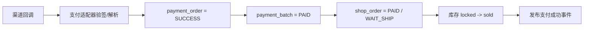
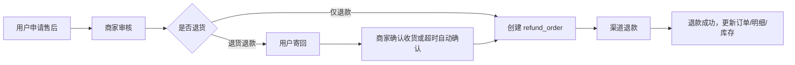
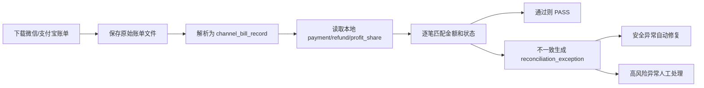

# B2B 多商家商城业务架构设计方案

> 沟通沉淀日期：2026-05-03  
> 配套 PPT：[b2b-multi-merchant-mall-architecture.pptx](../presentations/b2b-multi-merchant-mall-architecture.pptx)

## 1. 方案定位

本方案面向 B2B 多商家商城，参考成熟平台电商的商品、交易、支付、分账和治理模型，目标是支撑：

- 多商家入驻与店铺经营。
- 平台统一维护标准商品库。
- 商家基于标准商品发布店铺商品。
- 用户跨店铺一次结算、一次支付。
- 商家按店铺订单独立履约、售后、分账。
- 平台支持微信支付和支付宝支付两个渠道。
- 支付成功后资金先冻结或进入待分账状态，后续确认收货 T+7 再分账。
- 平台端具备订单运营、支付追踪、退款、分账、每日对账和治理能力。

核心原则：

- 商品标准化和商家经营灵活性分离。
- 支付批次和店铺订单分离。
- 店铺订单和商品明细分离。
- 履约、售后、分账、对账分别建模。
- 金额必须可追溯、可复算、可对账。
- 微信和支付宝差异收敛到支付/分账渠道适配器。

## 2. 核心业务对象

### 2.1 商品对象

```text
SPU -> Item -> SKU
```

| 对象 | 含义 | 主要职责 |
|---|---|---|
| SPU | 平台标准商品 | 类目、品牌、关键属性、标准参数 |
| Item | 商家发布商品 | 标题、主图、详情、服务、运费模板、审核状态 |
| SKU | 具体可售规格 | 销售属性组合、价格、库存、规格图、编码、上下架 |

关键口径：

- SPU 由平台统一维护，商家不能自由创建 SPU。
- Item 由商家发布，必须关联 SPU。
- SKU 由销售属性组合生成，是交易和库存的最小单元。
- 删除销售规格不物理删除 SKU，只禁售旧 SKU，保留库存、订单、售后和库存流水关系。

### 2.2 交易对象

```text
payment_batch -> shop_order -> order_item
```

| 对象 | 含义 | 主要职责 |
|---|---|---|
| payment_batch | 支付批次 / 合并付款批次 | 用户一次支付动作，聚合多笔店铺订单 |
| shop_order | 店铺订单 / 商家订单 | 商家履约、平台运营、分账的主对象 |
| order_item | 商品明细 / 商品子单 | SKU 快照、金额分摊、单品售后、评价 |

关键口径：

- `shop_order` 不是子订单，它是店铺维度的主订单。
- `order_item` 才是商品明细或商品子单。
- 用户端可以感知一次合并支付，但订单中心仍按店铺订单展示。
- 商家端只看到本店铺的 `shop_order`，看不到跨店铺 `payment_batch` 的全貌。
- 平台端既能看 `payment_batch`，也能看每笔 `shop_order`。

跨店铺下单示例：

```text
payment_batch PB001
  shop_order SO-A 店铺 A
    order_item A1 T 恤
    order_item A2 帽子
  shop_order SO-B 店铺 B
    order_item B1 鞋子
```

### 2.3 支付对象

```text
payment_order -> payment_batch
```

| 对象 | 含义 | 主要职责 |
|---|---|---|
| payment_batch | 商城业务支付批次 | 记录一次结算包含哪些订单、总金额、支付状态 |
| payment_order | 渠道支付尝试 | 记录一次微信/支付宝支付请求、回调、渠道交易号 |

关系：

```text
payment_batch 1 - n payment_order
payment_batch 1 - n shop_order
shop_order 1 - n order_item
```

为什么 `payment_batch 1 - n payment_order`：

- 用户一次结算生成一个 `payment_batch`。
- 用户可能先选微信支付未完成，再切换支付宝。
- 每一次渠道支付尝试都是一条 `payment_order`。
- 同一 `payment_batch` 同一时间只允许一个有效 `payment_order`。

建议复用现有支付域：

```text
payment_order.biz_type = MALL_PAYMENT_BATCH
payment_order.biz_order_id = payment_batch.id
```

## 3. 三端视角

### 3.1 用户端

用户端体验：

- 可跨店铺勾选购物车商品。
- 一次提交订单。
- 一次支付。
- 支付成功页展示一次支付成功，并列出多个店铺订单。
- 订单列表按 `shop_order` 展示。
- 售后按 `order_item` 和数量发起。

用户端不建议直接展示 `payment_batch` 这个技术名，可表达为：

- 合并支付。
- 支付记录。
- 本次支付。

### 3.2 商家端

商家端只处理本店铺数据：

- 本店商品。
- 本店 SKU 价格和库存。
- 本店 `shop_order`。
- 本店发货。
- 本店售后。
- 本店分账明细。

商家端不展示：

- 跨店铺 `payment_batch` 全貌。
- 用户同时购买的其他店铺商品。
- 其他商家的订单和分账数据。

### 3.3 平台端

平台端两层都需要：

- 订单运营主对象：`shop_order`。
- 支付追踪主对象：`payment_batch`。

平台订单中心默认按 `shop_order` 展示，因为实际运营动作落在店铺订单上：

- 催商家发货。
- 查看物流。
- 处理售后。
- 介入纠纷。
- 计算分账。
- 统计商家履约。

平台支付批次视图按 `payment_batch` 展示，用于：

- 用户支付问题排查。
- 支付回调异常排查。
- 微信/支付宝账单对账。
- 一次支付关联多笔店铺订单的追踪。

## 4. 核心模块拆分

商城按业务能力拆模块，不按端拆模块。买家端、商家端、平台端只是这些模块的不同入口。

### 4.1 模块全景

```text
catalog
merchant
item
inventory
checkout
order
payment
refund
fulfillment
aftersale
settlement
promotion
reconciliation
review
audit
notification
report
```

### 4.2 分层

| 层级 | 模块 | 职责 |
|---|---|---|
| 基础经营层 | catalog / merchant / item | 商品标准库、商家店铺、商家商品 |
| 交易履约层 | inventory / checkout / order / fulfillment / aftersale | 库存、结算、订单、发货、售后 |
| 资金财务层 | payment / refund / settlement / reconciliation | 支付、退款、分账、结算、对账 |
| 运营治理层 | promotion / review / audit / notification / report | 营销、评价、审计、通知、报表 |

### 4.3 各模块职责

#### catalog：商品标准库

核心表：

```text
category
attribute
attribute_value
category_attribute
brand
spu
spu_attr_value
```

职责：

- 类目树。
- 类目属性模板。
- 品牌库。
- SPU 标准商品。
- SPU 标准参数。
- 销售属性定义。

边界：

- 只管“商品是什么”。
- 不管“谁在卖”。
- 不管价格、库存、订单、支付。

#### merchant：商家与店铺

核心表：

```text
merchant
shop
merchant_staff
merchant_role
merchant_pay_account
shop_category_auth
```

职责：

- 商家入驻。
- 店铺资料。
- 经营类目授权。
- 商家员工权限。
- 微信/支付宝收款和分账账户。
- 商家启停。

#### item：商家商品

核心表：

```text
item
item_image
item_detail
item_audit_record
sku
sku_attr_value
sku_operation_log
```

职责：

- 商家选择 SPU 发布商品。
- 商品标题、主图、详情。
- SKU 规格组合。
- SKU 价格和上下架。
- 商品审核。
- 规格内容审核。

关键规则：

- 标题、主图、详情、类目/SPU 关联、服务承诺变更需要审核。
- 新增/删除/修改规格内容、规格图需要审核。
- SKU 价格、库存、上下架即时生效，但必须留操作日志。

#### inventory：库存

核心表：

```text
sku_stock
stock_lock
stock_flow
```

职责：

- 总库存。
- 锁定库存。
- 可售库存。
- 库存流水。
- 提交订单锁库存。
- 支付超时释放库存。
- 支付成功确认占用。
- 退款/退货回补库存。

首版规则：

- SKU 单库存。
- 不做多仓。
- 不做区域库存。

#### checkout：购物车与结算

核心表：

```text
cart_item
checkout_session
submit_token
```

职责：

- 购物车。
- 结算页。
- 价格、活动、库存重算。
- 支付渠道可用性计算。
- `submitToken` 防重复提交。
- 跨店铺拆单预览。

关键规则：

- 提交订单时按最新价格、活动、库存重算。
- 如果价格或活动变化，提示用户确认。
- 支付渠道按本次所有店铺都可用的渠道交集展示。

#### order：订单

核心表：

```text
payment_batch
shop_order
order_item
order_status_log
order_address_snapshot
order_amount_snapshot
```

职责：

- 跨店支付批次。
- 店铺订单。
- 商品明细。
- 订单状态。
- 订单金额快照。
- 收货地址快照。
- 订单取消。
- 确认收货。

核心关系：

```text
payment_batch 1 - n shop_order
shop_order 1 - n order_item
```

#### payment：支付

核心表：

```text
payment_order
payment_channel_record
payment_notify_log
payment_exception
```

职责：

- 微信支付。
- 支付宝支付。
- 支付尝试。
- 支付回调。
- 支付查询。
- 关闭支付。
- 支付异常。

关键规则：

- `payment_order` 是渠道支付尝试。
- 同一 `payment_batch` 可有多次 `payment_order` 尝试。
- 切换支付渠道时关闭旧 `payment_order`。
- 支付成功后回写 `payment_batch` 和 `shop_order`。
- 超时关闭后晚到支付成功回调，进入 `PAY_EXCEPTION`，不自动恢复订单。

#### refund：退款

核心表：

```text
refund_order
refund_item
refund_notify_log
```

职责：

- 渠道退款。
- 退款状态。
- 退款回调。
- 退款幂等。
- 退款金额校验。
- 分账前退款。
- 分账后先回退再退款。

边界：

- 售后决定“能不能退”。
- refund 负责“钱有没有退成功”。

#### fulfillment：发货物流

核心表：

```text
shipment
shipment_log
address_change_request
```

职责：

- 商家发货。
- 快递公司。
- 快递单号。
- 发货时间。
- 确认收货。
- 自动确认收货。
- 改地址申请。

首版规则：

- 只支持快递配送。
- 一个 `shop_order` 一次发货。
- 不支持部分发货。
- 不支持多包裹。
- 发货后 10 天自动确认收货。
- 物流轨迹先预留，首版手动录单号。

#### aftersale：售后

核心表：

```text
aftersale_order
aftersale_item
aftersale_log
return_shipment
platform_intervention
```

职责：

- 仅退款。
- 退货退款。
- 部分数量退款。
- 商家审核。
- 平台介入。
- 退货物流。
- 售后超时处理。

规则：

- 未发货取消自动退款。
- 已发货支持退货退款。
- 同一 `order_item` 支持按数量部分退。
- 商家超时自动同意。
- 退货物流签收后，商家超时不处理自动退款。
- 售后中订单不进入分账池。

#### settlement：分账与结算

核心表：

```text
profit_share_order
profit_share_receiver
profit_share_log
settlement_bill
settlement_bill_item
commission_rule
platform_subsidy_record
```

职责：

- 确认收货 T+7 可分账。
- 平台佣金计算。
- 商家应分金额计算。
- 微信分账。
- 支付宝分账。
- 分账失败重试。
- 分账完结和解冻。
- 平台补贴结算。

规则：

- 佣金按商家实收基数。
- 运费给商家，但不计佣。
- 渠道手续费由平台承担。
- 平台券补贴进入结算单。
- 分账成功且无剩余待分金额后，主动调用渠道分账完结/解冻。

#### promotion：营销

核心表：

```text
coupon
coupon_receive
promotion_activity
promotion_rule
promotion_usage
```

职责：

- 平台券。
- 商家券。
- 满减。
- 活动价。
- 包邮。
- 优惠分摊。
- 优惠使用记录。

规则：

- 平台券可跨店分摊。
- 商家券只影响本店订单。
- 优惠分摊到 `order_item`。
- 活动归属决定成本承担。

#### reconciliation：对账

核心表：

```text
reconciliation_job
reconciliation_file
channel_bill_record
reconciliation_exception
```

职责：

- 微信账单导入。
- 支付宝账单导入。
- 支付对账。
- 退款对账。
- 分账对账。
- 资金账单对账。
- 差异识别。
- 异常修复。

#### review：评价

核心表：

```text
item_review
review_image
shop_score
review_reply
```

职责：

- `order_item` 评价。
- 商品评分。
- 店铺评分。
- 商家回复。
- 基础评价展示。

首版规则：

- 确认收货后可评价。
- 不做追评。
- 不做复杂风控。

#### audit / access：权限与审计

核心表：

```text
admin_role
admin_permission
merchant_role
merchant_permission
audit_log
```

职责：

- 平台角色权限。
- 商家店铺角色权限。
- 关键操作审计。
- 财务操作审计。
- 商品审核日志。
- 价格库存变更日志。

关键审计范围：

- 商品审核。
- 价格库存。
- 订单退款。
- 分账。
- 权限变更。
- 商家账户。
- 支付异常处理。

#### notification：通知

核心表：

```text
notification_task
notification_template
notification_log
```

职责：

- 支付成功通知。
- 发货通知。
- 退款通知。
- 售后通知。
- 分账失败通知。
- 商家待处理提醒。
- 平台异常提醒。

#### report：报表

核心表：

```text
sales_daily_stat
merchant_daily_stat
product_daily_stat
finance_daily_stat
```

职责：

- GMV。
- 支付金额。
- 退款金额。
- 订单数。
- 客单价。
- 商家销售额。
- 平台佣金。
- 平台补贴。
- 分账成功率。
- 售后率。

## 5. 聚合层设计

按现有 Forest 架构，单域能力放在 `business/domains/*`，跨域编排放在 `business/aggregations/*`。

建议聚合模块：

```text
business/aggregations/mall-checkout
business/aggregations/mall-order
business/aggregations/mall-finance
business/aggregations/mall-admin
```

### mall-checkout

职责：

- 购物车结算。
- 价格、活动、库存重算。
- 支付渠道交集计算。
- `submitToken` 防重复。
- 创建 `payment_batch`、`shop_order`、`order_item`。
- 调用库存锁定。

### mall-order

职责：

- 用户订单详情。
- 商家订单详情。
- 平台订单详情。
- 跨域组装商品、支付、物流、售后、分账状态。

### mall-finance

职责：

- 支付批次视图。
- 退款视图。
- 分账视图。
- 平台补贴视图。
- 对账差异视图。
- 财务导出。

### mall-admin

职责：

- 平台后台跨域工作台。
- 商品审核。
- 商家治理。
- 支付异常处理。
- 分账失败处理。
- 对账异常处理。

## 6. 跨店订单设计

### 6.1 基本流程


### 6.2 关键规则

- 用户跨店铺一次支付。
- 系统按店铺生成多笔 `shop_order`。
- 每个 `shop_order` 下有多个 `order_item`。
- 首版一个 `shop_order` 一次发货。
- 售后可按 `order_item` 和数量发起。
- 分账按 `shop_order` 计算。

### 6.3 命名口径

最终建议使用：

```text
payment_batch：支付批次 / 合并付款批次
shop_order：店铺订单 / 商家订单
order_item：商品明细 / 商品子单
```

不建议使用：

```text
trade_order：容易被误解为泛交易订单
子订单：容易把 shop_order 和 order_item 混淆
```

## 7. 支付设计

### 7.1 多端支付渠道矩阵

| 端 | 微信支付 | 支付宝支付 | 说明 |
|---|---|---|---|
| 微信小程序 | 小程序支付 | 不在小程序内提供 | 微信小程序内只展示微信支付 |
| PC Web | 微信扫码支付 | 支付宝扫码/网页支付 | 推荐统一收银台 |
| 移动 H5 | 微信 H5 / 微信内 JSAPI | 支付宝 WAP | 根据浏览器环境选择 |
| 后续 App | App 支付 SDK | App 支付 SDK | 当前不作为首版重点 |

### 7.2 支付批次状态

`payment_batch` 状态：

```text
INIT
PAYING
PAID
CLOSED
PAY_EXCEPTION
```

含义：

| 状态 | 含义 |
|---|---|
| INIT | 支付批次已创建，尚未创建有效渠道支付 |
| PAYING | 已创建渠道支付尝试 |
| PAID | 渠道确认支付成功 |
| CLOSED | 用户取消、超时关闭或平台关闭 |
| PAY_EXCEPTION | 晚到支付回调、金额异常等 |

### 7.3 支付尝试状态

`payment_order` 继续复用现有状态，并可扩展渠道和场景：

```text
CREATED
PREPAY_CREATED
SUCCESS
FAILED
CLOSED
```

建议新增或扩展字段：

```text
payment_channel: WECHAT_PAY / ALIPAY
payment_scene: WECHAT_MINIAPP / WECHAT_PC_QR / WECHAT_H5 / WECHAT_JSAPI / ALIPAY_PC / ALIPAY_WAP
```

### 7.4 支付成功回写



事务边界：

- 支付回调内本地事务更新支付批次、店铺订单、库存。
- 事务成功后发布领域事件。
- 通知、报表等后续能力异步处理。
- 每日对账负责发现回调丢失或本地处理失败。

### 7.5 异常规则

| 场景 | 处理 |
|---|---|
| 用户重复点击提交订单 | 使用 `submitToken`，同一 token 只创建一次订单 |
| 用户切换支付渠道 | 关闭旧 `payment_order`，新建支付尝试 |
| 30 分钟未支付 | 关闭 `payment_batch` 和订单，释放锁定库存 |
| 本地超时关闭后渠道支付成功 | 进入 `PAY_EXCEPTION`，不自动恢复订单 |
| 重复支付回调 | 幂等返回，不重复扣库存、不重复发布事件 |

## 8. 退款与售后

### 8.1 售后类型

首版支持：

- 未发货仅退款。
- 已发货退货退款。
- 同一 `order_item` 按数量部分退。

首版不支持：

- 换货。
- 维修。
- 多次复杂售后。
- 部分发货下的售后。

### 8.2 售后流程



### 8.3 售后超时

- 商家审核超时，系统自动同意。
- 用户寄回退货后，物流签收且商家超时未处理，系统自动退款。
- 争议售后可由平台介入。

### 8.4 运费退款规则

| 场景 | 运费处理 |
|---|---|
| 未发货退款 | 全退，含运费 |
| 已发货非商家责任 | 默认不退发货运费 |
| 已发货商家责任 | 可退运费 |

## 9. 分账与结算

### 9.1 资金链路


### 9.2 分账触发

- 确认收货后 T+7。
- 没有未完结售后。
- 订单状态满足可分账。
- 定时扫描触发分账。
- 领域事件只做加速补充，不作为唯一触发。

### 9.3 分账失败

- 系统自动重试。
- 超过次数进入平台后台人工处理。
- 失败原因、渠道请求、渠道响应必须留日志。

### 9.4 退款与分账关系

| 资金状态 | 退款处理 | 分账处理 |
|---|---|---|
| 未分账 | 从渠道冻结/待分账资金退款 | 减少可分账金额 |
| 分账中 | 暂停或等待分账结果 | 标记风险 |
| 已分账 | 先分账回退，再退款 | 生成回退单和退款单 |

## 10. 金额规则

### 10.1 金额单位

所有金额字段使用整数分：

```text
amount_cents
```

禁止使用浮点金额。

### 10.2 金额快照粒度

订单和明细都存金额快照：

- `shop_order` 存汇总金额。
- `order_item` 存分摊明细金额。

原因：

- 订单列表查询更快。
- 售后退款按明细计算更稳定。
- 分账和对账可以追溯。
- 历史订单不受商品价格变化影响。

### 10.3 推荐字段

`shop_order` 金额字段：

```text
goods_amount_cents
merchant_discount_cents
platform_discount_cents
shipping_fee_cents
pay_amount_cents
refund_amount_cents
commission_cents
settle_amount_cents
platform_subsidy_cents
```

`order_item` 金额字段：

```text
origin_price_cents
activity_price_cents
quantity
merchant_discount_share_cents
platform_discount_share_cents
shipping_fee_share_cents
pay_share_cents
refund_amount_cents
commission_share_cents
settle_share_cents
```

### 10.4 分摊规则

- 平台券、运费、满减等跨明细分摊，按比例分摊到分。
- 舍入差额补到实付金额最大的 `order_item`。
- 分摊规则必须固定，保证可复现。

### 10.5 佣金与补贴

- 佣金按商家实收基数计算。
- 商品价扣除商家优惠后计佣。
- 运费给商家，但不计佣。
- 平台券由平台承担。
- 平台券导致渠道实付不足以覆盖商家应得时，进入 `settlement_bill` 的平台补贴应付。
- 微信/支付宝手续费由平台承担。

### 10.6 0 元订单

首版不允许 0 元订单。

原因：

- 避免无支付单订单状态机。
- 避免支付、分账、风控复杂化。
- 可设置最低支付 0.01 元。

## 11. 库存规则

### 11.1 基本规则

- 提交订单即锁库存。
- 30 分钟未支付自动关闭订单并释放库存。
- 支付成功后锁定库存转为已售占用。
- 退款/退货完成后按规则回补库存。

### 11.2 库存字段

```text
total_stock
locked_stock
available_stock
```

其中：

```text
available_stock = total_stock - locked_stock - sold_or_occupied_stock
```

具体是否单独保存 `available_stock` 可由实现决定，但并发扣减必须保证正确。

### 11.3 SKU 删除规格

删除规格时：

- 不物理删除 SKU。
- 标记为 `OFF_SALE` 或 `DISABLED`。
- 保留库存。
- 保留锁定库存。
- 保留历史订单、售后和库存流水。

## 12. 履约规则

首版履约规则：

- 商家自发货。
- 只支持快递配送。
- 一个 `shop_order` 一次发货。
- 不支持部分发货。
- 不支持多包裹。
- 商家录入快递公司和快递单号。
- 物流轨迹 API 后续接入。
- 发货后 10 天自动确认收货。

地址修改：

- 已支付未发货时，买家可申请修改地址。
- 商家确认后生效。
- 买家不能直接无条件修改，避免商家已拣货或发货导致误发。

## 13. 商品治理规则

### 13.1 商品审核

需要重新审核：

- 商品标题。
- 主图。
- 详情。
- 类目或 SPU 关联。
- 服务承诺。
- 新增/删除/修改规格内容。
- 规格图。

即时生效但留日志：

- SKU 价格。
- SKU 库存。
- SKU 上下架。

### 13.2 SPU 变更

平台修改 SPU 标准参数后：

- 标准参数同步到关联 Item 展示。
- 商家自定义标题、详情、价格、库存不被覆盖。

### 13.3 商家取消订单

商家因缺货等原因取消已支付订单：

- 需要记录责任原因。
- 系统发起退款。
- 进入平台治理数据。
- 可用于后续商家评分、处罚或限制。

## 14. 支付渠道设计

### 14.1 支付渠道抽象

建议接口：

```text
PaymentChannelGateway
  createPayment(...)
  parsePaymentNotify(...)
  queryPayment(...)
  closePayment(...)
  requestRefund(...)
```

### 14.2 分账渠道抽象

建议接口：

```text
ProfitShareChannelGateway
  requestProfitShare(...)
  queryProfitShare(...)
  finishProfitShare(...)
  requestProfitShareReturn(...)
```

### 14.3 微信

微信侧按：

- 微信小程序支付。
- PC 扫码支付。
- H5 / JSAPI。
- 电商收付通。
- 分账能力。
- 交易账单、资金账单、分账账单。

### 14.4 支付宝

支付宝侧按：

- PC 支付。
- WAP 支付。
- 后续 App 支付。
- 直付通。
- 交易结算分账。
- 交易账单、资金流水、结算相关账单。

最终以渠道签约产品和官方能力为准。

## 15. 每日对账

### 15.1 对账目的

每日对账是财务兜底机制，用来核对：

```text
本地系统账
vs
微信/支付宝渠道账
```

它不是用户支付主流程的一部分，而是发现漏单、错账、金额不一致的机制。

### 15.2 对账范围

至少包括：

- 支付对账。
- 退款对账。
- 分账对账。
- 资金账单对账。

### 15.3 对账流程



### 15.4 典型异常

| 异常 | 说明 | 处理 |
|---|---|---|
| 渠道成功，本地未支付 | 回调丢失或本地处理失败 | 订单仍有效可自动补成功，否则异常处理 |
| 本地成功，渠道无记录 | 本地状态错误或渠道查询延迟 | 查询渠道，必要时人工处理 |
| 金额不一致 | 本地金额和渠道金额不同 | 不自动修复，人工核查 |
| 渠道退款成功，本地退款中 | 本地状态未更新 | 可自动更新 |
| 分账成功，本地未更新 | 分账回调或查询未同步 | 可自动更新 |
| 分账接收方不一致 | 本地和渠道接收方不同 | 高风险，人工处理 |

## 16. 状态机

### 16.1 shop_order 状态字段

建议拆为多状态字段：

```text
order_status
pay_status
ship_status
aftersale_status
profit_share_status
close_reason
```

原因：

- 已支付但未发货。
- 已发货但售后中。
- 已确认收货但待分账。
- 分账失败但订单履约完成。

这些组合状态如果只用一个 `status` 表达，会导致状态爆炸。

### 16.2 shop_order 主状态

建议值：

```text
CREATED
ACTIVE
CANCELED
CLOSED
COMPLETED
```

`COMPLETED` 定义：

- 分账完成后进入。
- 用户确认收货后可以评价，但不代表财务完成。

### 16.3 order_item 状态

建议字段：

```text
aftersale_status
refund_status
review_status
```

部分退款：

- 不拆新明细行。
- 用数量和金额字段表达：

```text
purchased_quantity
refunded_quantity
refundable_quantity
refunded_amount_cents
```

### 16.4 分账状态

建议值：

```text
WAITING
READY
PROCESSING
SUCCESS
FAILED
RETURNING
RETURNED
```

含义：

- `WAITING`：确认收货前或售后保护期内。
- `READY`：确认收货 T+7 且无售后中。
- `PROCESSING`：已请求渠道分账。
- `SUCCESS`：分账成功。
- `FAILED`：分账失败。
- `RETURNING`：分账回退中。
- `RETURNED`：分账已回退。

## 17. 编号与幂等

### 17.1 编号规则

外部单号建议使用业务前缀 + 时间 + 序列，不直接暴露数据库 ID。

示例：

```text
PB：payment_batch_no
SO：shop_order_no
OI：order_item_no，可选
PO：payment_order_no
RF：refund_no
PS：profit_share_no
AF：aftersale_no
```

### 17.2 幂等键

| 场景 | 幂等键 |
|---|---|
| 提交订单 | submitToken |
| 支付请求 | payment_order_no |
| 退款请求 | refund_no |
| 分账请求 | profit_share_no |
| 分账回退 | profit_share_return_no |

原则：

- 对外请求不能每次重试生成新编号。
- 渠道回调必须幂等。
- 本地业务状态更新必须幂等。

## 18. API 方向

### 18.1 买家端

```text
GET/POST /api/client/cart
POST     /api/client/checkout/preview
POST     /api/client/order/submit
GET      /api/client/order
GET      /api/client/order/{id}
POST     /api/client/order/{id}/cancel
POST     /api/client/order/{id}/confirm-receipt
POST     /api/client/payment-batch/{id}/pay
GET      /api/client/payment-batch/{id}
POST     /api/client/aftersale
GET      /api/client/aftersale/{id}
POST     /api/client/review
```

### 18.2 商家端

```text
GET/POST /api/admin/item
POST     /api/admin/item/{id}/submit-audit
POST     /api/admin/item/{id}/on-sale
POST     /api/admin/item/{id}/off-sale
PATCH    /api/admin/sku/{id}/price
PATCH    /api/admin/sku/{id}/stock
GET      /api/admin/order
GET      /api/admin/order/{id}
POST     /api/admin/order/{id}/ship
GET      /api/admin/aftersale
POST     /api/admin/aftersale/{id}/approve
POST     /api/admin/aftersale/{id}/reject
GET      /api/admin/profit-share
GET      /api/admin/pay-account
```

### 18.3 平台端

```text
GET/POST /api/platform/category
GET/POST /api/platform/attribute
GET/POST /api/platform/spu
GET/POST /api/platform/merchant
POST     /api/platform/item-audit/{id}/approve
POST     /api/platform/item-audit/{id}/reject
GET      /api/platform/order
GET      /api/platform/payment-batch
GET      /api/platform/refund
GET      /api/platform/aftersale
POST     /api/platform/aftersale/{id}/intervene
GET      /api/platform/profit-share
POST     /api/platform/profit-share/{id}/retry
GET      /api/platform/reconciliation
POST     /api/platform/reconciliation/{id}/resolve
GET      /api/platform/audit-log
GET      /api/platform/report
```

## 19. 实施路径

### 一期：商品、店铺、库存、购物车、订单

目标：

- 跑通商品发布、SKU、库存、购物车、下单。

范围：

- catalog。
- merchant。
- item。
- inventory。
- checkout。
- order。

必须首版完成：

- `payment_batch / shop_order / order_item` 模型。
- 提交订单锁库存。
- 30 分钟未支付关闭。
- `submitToken` 防重复提交。
- 金额快照。

### 二期：支付与退款

目标：

- 接入微信和支付宝支付。
- 跑通支付批次、支付尝试、支付回调、退款。

范围：

- payment。
- refund。
- 支付渠道适配器。

必须完成：

- `payment_order` 绑定 `payment_batch`。
- 微信/支付宝支付场景。
- 支付幂等。
- 晚到回调异常池。
- 分账前退款。

### 三期：履约、售后、分账、结算

目标：

- 跑通商家发货、售后、确认收货、T+7 分账。

范围：

- fulfillment。
- aftersale。
- settlement。

必须完成：

- 一个 `shop_order` 一次发货。
- 售后按数量部分退。
- 分账前退款。
- 分账后先回退再退款。
- 分账失败重试。
- 平台补贴结算。

### 四期：对账、评价、报表、治理、风控

目标：

- 建立长期运营、财务和治理能力。

范围：

- reconciliation。
- review。
- audit。
- notification。
- report。
- 风控能力。

必须完成：

- 每日渠道账单导入。
- 支付、退款、分账对账。
- 对账异常处理。
- 基础评价。
- 商家治理统计。
- 关键操作审计。

## 20. 当前关键决策汇总

| 决策项 | 最终口径 |
|---|---|
| 商品模型 | SPU -> Item -> SKU |
| SPU 维护 | 平台统一维护 |
| 店铺订单命名 | 使用 `shop_order` |
| 跨店支付 | 一个 `payment_batch` 关联多笔 `shop_order` |
| 商家端是否看跨店总单 | 不看，只看本店 `shop_order` |
| 平台端订单主对象 | 默认按 `shop_order` 运营 |
| 支付执行单 | `payment_order`，绑定 `payment_batch` |
| 支付渠道 | 微信 + 支付宝 |
| 微信小程序支付宝 | 不在微信小程序内提供支付宝支付 |
| 支付后资金 | 渠道侧冻结/待分账 |
| 分账时点 | 确认收货 T+7 |
| 分账失败 | 自动重试 + 人工兜底 |
| 库存 | 提交订单即锁库存 |
| 支付超时 | 30 分钟关闭并释放库存 |
| 发货 | 首版一个 `shop_order` 一次发货 |
| 售后 | 商家先审，平台可介入，支持按数量部分退 |
| 运费 | 店铺运费模板合并计算，运费给商家但不计佣 |
| 平台券 | 可跨店分摊，平台承担 |
| 佣金 | 按商家实收基数，不含运费 |
| 手续费 | 微信/支付宝手续费平台承担 |
| 0 元订单 | 首版不允许 |
| 对账 | 每日导入微信/支付宝账单对账 |
| 权限 | 平台和商家均采用角色权限 |
| 审计 | 关键操作留审计日志 |

## 21. 后续仍需业务确认的点

以下不是当前方案的阻塞项，但进入详细 PRD 或研发排期前需要继续确认：

- B2B 买家是否有企业认证、授信、账期支付。
- 是否需要询价、议价、阶梯价、合同价。
- 是否需要采购单、对公转账、线下付款。
- 是否需要发票流程，首版当前仅预留。
- 平台补贴结算是否线上自动打款，还是先做账单。
- 商家治理指标如何影响搜索排序或店铺权重。
- 风控规则如何拦截恶意下单、薅券、异常退款。
- 是否需要后续支持多仓、部分发货、多包裹。
- 是否需要完整物流轨迹 API。
- 支付宝直付通和微信电商收付通的实际签约限制。
