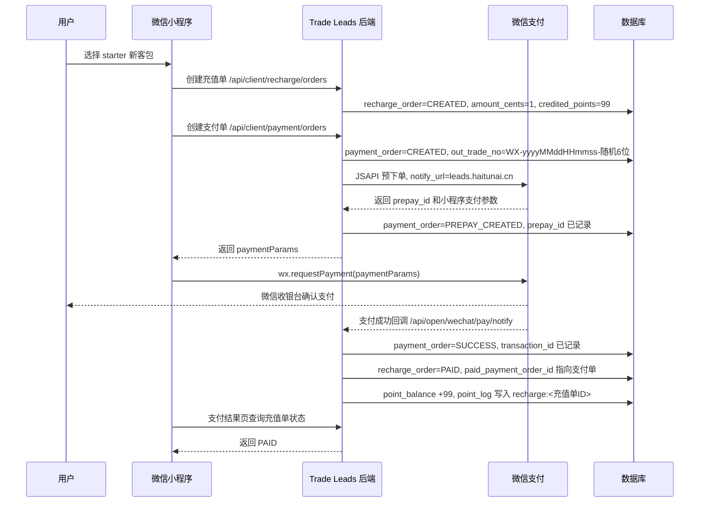

# 微信小程序支付对接总结

本文记录 `trade-leads` 微信小程序支付对接的最终状态、关键链路、配置口径、验收结果和排障经验。

相关测试清单见：

- [微信小程序支付链路测试清单](/Users/lgd/project/forest/apps/trade-leads/docs/features/payment/wechat-miniapp-payment-test.md)

## 1. 对接结论

微信小程序支付已完成真实链路验证。

本次验收链路：

- 套餐：`starter / 新客包`
- 测试金额：`0.01 元`
- 到账积分：`99`
- 小程序 API 域名：`https://leads.haitunai.cn`
- 微信支付回调域名：`https://leads.haitunai.cn/api/open/wechat/pay/notify`
- 验收标准：`payment_order.status=SUCCESS`、`recharge_order.status=PAID`、`point_balance +99`、`point_log` 只有一条充值入账流水

真实验收样例：

| 项 | 结果 |
| --- | --- |
| 充值单 | `recharge_order.id=5034` |
| 支付单 | `payment_order.id=6034` |
| 套餐 | `starter` |
| 金额 | `1` 分 |
| 积分 | `99` |
| 支付状态 | `SUCCESS` |
| 充值状态 | `PAID` |
| 积分余额 | `99` |
| 积分流水 | `biz_key=recharge:5034`，数量 `1` |

注意：生产库里 `created_time / notify_time / point_log.created_time` 和微信 `paid_time` 曾出现 8 小时时区口径差。业务状态验收不受影响，但后续做日志观测时建议统一时间口径。

## 2. 端到端链路



核心事实：

- `recharge_order` 是业务主单，锁定套餐、金额和到账积分。
- `payment_order` 是支付执行单，记录微信预下单、支付回调和微信交易号。
- `point_balance / point_log` 是积分账本，只在充值域确认 `PAID` 后入账。
- 支付结果页以服务端状态为准，不以 `wx.requestPayment` 的返回值作为最终入账依据。

## 3. 关键配置

小程序 API Base URL 已构建时环境化：

```bash
# 本地包，默认连接 localleads
pnpm --dir /Users/lgd/project/forest/base-frontend --filter @forest/trade-leads-client-wechat-miniapp build:local

# 体验版 / prod 包，连接 leads.haitunai.cn
pnpm --dir /Users/lgd/project/forest/base-frontend --filter @forest/trade-leads-client-wechat-miniapp build:prod
```

`build:prod` 会注入：

```text
MINIAPP_API_BASE_URL=https://leads.haitunai.cn
```

后端生产支付配置口径：

```text
WECHAT_PAY_ENABLED=true
WECHAT_PAY_MOCK_ENABLED=false
WECHAT_PAY_NOTIFY_URL=https://leads.haitunai.cn/api/open/wechat/pay/notify
```

生产证书挂载约定：

```text
/home/app/trade-leads/wechat-key/apiclient_key.pem
/home/app/trade-leads/wechat-key/wechatpay_public_key.pem
```

容器内读取路径：

```text
/run/secrets/wechat-pay/apiclient_key.pem
/run/secrets/wechat-pay/wechatpay_public_key.pem
```

不要把任何真实密钥、API v3 key、证书文件提交到仓库。

## 4. 关键实现位置

小程序侧：

| 职责 | 位置 |
| --- | --- |
| 充值页创建充值单、创建支付单、拉起微信支付 | `apps/trade-leads/clients/client-wechat-miniapp/src/pages/recharge/index.ts` |
| 支付结果页查询充值状态、跳转我的/充值/线索池 | `apps/trade-leads/clients/client-wechat-miniapp/src/pages/payment-result/index.ts` |
| 小程序 API 域名配置 | `apps/trade-leads/clients/client-wechat-miniapp/src/app.config.ts` |
| prod/local 构建注入 | `apps/trade-leads/clients/client-wechat-miniapp/scripts/build-miniapp.mjs` |
| 微信路由封装 | `base-frontend/packages/wechat-miniapp-platform/src/router.ts` |
| 微信支付拉起封装 | `base-frontend/packages/wechat-miniapp-platform/src/wechat-miniapp-payment.ts` |

后端侧：

| 职责 | 位置 |
| --- | --- |
| 创建支付单、处理支付回调、发布支付成功事件 | `business/domains/payment/backend/src/main/java/com/forest/payment/service/impl/PaymentOrderServiceImpl.java` |
| 微信支付预下单、回调验签解密 | `business/domains/payment/backend/src/main/java/com/forest/payment/channel/wechat/WechatPayGateway.java` |
| 微信支付回调入口 | `business/domains/payment/backend/src/main/java/com/forest/payment/notify/WechatPayNotifyController.java` |
| 创建充值单、充值到账 | `business/domains/recharge/backend/src/main/java/com/forest/recharge/service/impl/RechargeOrderServiceImpl.java` |
| 支付成功后推进充值单 | `business/domains/recharge/backend/src/main/java/com/forest/recharge/event/PaymentSucceededEventListener.java` |
| 充值到账后积分入账 | `business/domains/point/backend/src/main/java/com/forest/point/event/RechargePaidEventListener.java` |

## 5. 数据字段关系

`payment_order` 中三类单号的业务关系：

| 字段 | 来源 | 用途 |
| --- | --- | --- |
| `payment_no` | 本系统生成 | 本地支付单号，用于后台和日志排查，不直接传给微信 |
| `out_trade_no` | 本系统生成 | 商户订单号，传给微信；微信回调用它反查本地支付单 |
| `prepay_id` | 微信预下单返回 | 微信预支付会话 ID，用于生成小程序调起支付参数 |
| `transaction_id` | 微信支付成功回调返回 | 微信侧交易号，是微信确认交易成功的凭证 |

当前单号格式：

```text
payment_no  = PAY-yyyyMMddHHmmss-随机6位
out_trade_no = WX-yyyyMMddHHmmss-随机6位
```

调整原因：

- 微信 `out_trade_no` 长度限制为 `32`。
- 原 UUID 方案 `OUT-` + 32 位随机串长度过长。
- 新格式长度为 `24`，满足微信要求，也便于人工排查。

## 6. 验收 SQL

最近支付单：

```sql
select id, payment_no, biz_type, biz_order_id, channel, amount_cents,
       status, out_trade_no, length(out_trade_no) as out_trade_no_len,
       prepay_id, transaction_id, notify_time, paid_time
from payment_order
order by id desc
limit 5;
```

最近充值单：

```sql
select id, recharge_no, user_id, package_code, amount_cents,
       credited_points, status, paid_payment_order_id,
       created_time, paid_time
from recharge_order
order by id desc
limit 5;
```

积分余额：

```sql
select user_id, balance, total_income, total_spend, version, modified_time
from point_balance
where user_id = <测试用户ID>;
```

积分流水：

```sql
select id, user_id, direction, amount, balance_after,
       source_type, source_id, biz_key, created_time
from point_log
where user_id = <测试用户ID>
order by id desc
limit 10;
```

幂等检查：

```sql
select count(*) as point_log_count
from point_log
where biz_key = 'recharge:' || <充值单ID>;
```

预期：

- `payment_order.status=SUCCESS`
- `recharge_order.status=PAID`
- `recharge_order.paid_payment_order_id = payment_order.id`
- `point_log.biz_key=recharge:<充值单ID>` 且数量为 `1`
- `point_balance.balance` 增加 `99`

## 7. 已处理问题和排障经验

### 证书文件错误

现象：

```text
Illegal base64 character 2d
```

原因：

- 微信支付公钥文件误放成了私钥内容。
- `wechatpay_public_key.pem` 必须以 `-----BEGIN PUBLIC KEY-----` 开头。

### 商户订单号错误

现象：

```text
PARAM_ERROR: 商户订单号错误,请核实后再试
```

原因：

- 原 `out_trade_no` 长度超过微信限制。

修复：

- 改为 `WX-yyyyMMddHHmmss-随机6位`。

### 支付结果页按钮无反应

现象：

- `回到我的`
- `继续充值`
- `返回线索池`

点击后看起来没有反应。

处理：

- 支付结果页是支付流程终点，跳转时使用 `miniappRouter.reLaunchPage(...)` 清理旧页面栈。
- 路由失败时输出：

```text
[miniapp-router] route failed
[payment-result] navigate failed
```

- 用户侧提示：

```text
跳转失败，请重试
```

如果体验版仍出现跳转问题，使用微信开发者工具真机调试查看上述日志里的 `errMsg`。

## 8. 发布和验证命令

小程序验证：

```bash
pnpm --dir /Users/lgd/project/forest/base-frontend --filter @forest/trade-leads-client-wechat-miniapp typecheck
pnpm --dir /Users/lgd/project/forest/base-frontend --filter @forest/trade-leads-client-wechat-miniapp check:architecture
pnpm --dir /Users/lgd/project/forest/base-frontend --filter @forest/trade-leads-client-wechat-miniapp build:prod
```

平台包验证：

```bash
pnpm --dir /Users/lgd/project/forest/base-frontend --filter @forest/wechat-miniapp-platform build
pnpm --dir /Users/lgd/project/forest/base-frontend --filter @forest/wechat-miniapp-platform test
pnpm --dir /Users/lgd/project/forest/base-frontend --filter @forest/wechat-miniapp-client-app build
```

后端支付链路测试：

```bash
mvn -f /Users/lgd/project/forest/base-backend/pom.xml \
  -pl ../apps/trade-leads/backend \
  -am \
  -Dtest=TradeLeadsApiIntegrationTest \
  -DfailIfNoTests=false \
  -Dsurefire.failIfNoSpecifiedTests=false \
  test
```

体验版上传前确认：

- `build:prod` 产物连接 `https://leads.haitunai.cn`。
- 微信公众平台已配置 request 合法域名 `https://leads.haitunai.cn`。
- 微信开发者工具打开的是 `/Users/lgd/project/forest/apps/trade-leads/clients/client-wechat-miniapp`。
- 上传体验版时使用真实小程序 AppID，不使用 `touristappid`。
